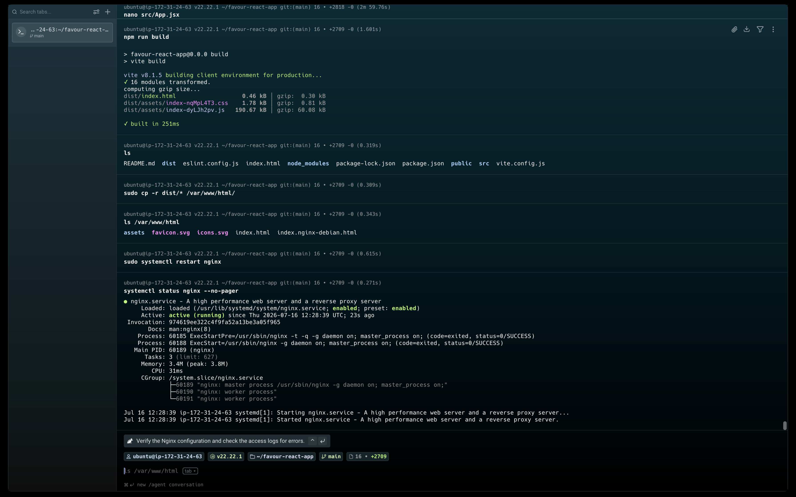
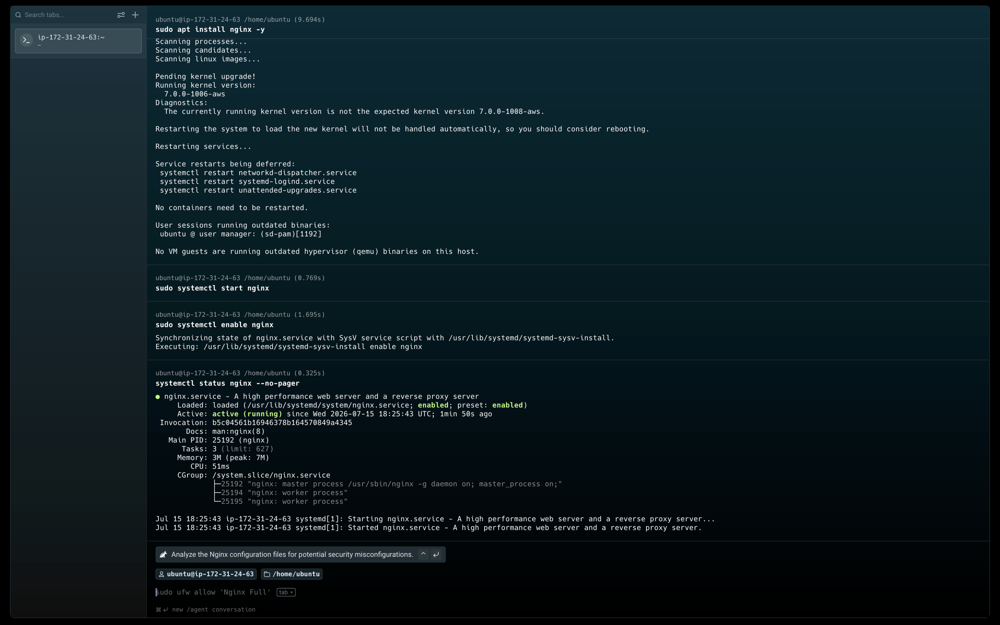

# Week 03 — Linux for DevOps

## Assignment Overview

This week covers Linux fundamentals, Nginx, deploying a React app, and performing
production-style operational checks — the way an on-call DevOps engineer would.

> **Proof Rule:** Your full name must appear in every screenshot (visible in terminal prompt or window title).

---

## Task 1: AWS Cloud Access Setup

**Task:** Set up basic cloud access for future labs.

**What I did:**

I created an AWS Free Tier account using my email address, set up billing, and verified my identity. After signing in to the AWS Management Console, I navigated to the Account section to confirm the account is active and ready for provisioning cloud resources like EC2 instances.

**Screenshot:**


---

## Task 2: Deploy React App with Nginx on Linux

**Task:** Deploy a real application on a Linux server using Nginx.

**Server details:**

| | |
|---|---|
| OS | Ubuntu 22.04 LTS |
| Server IP | 54.167.8.10 |
| App URL | http://54.167.8.10 |

**Commands I ran:**

```bash
# Install Node.js and npm
sudo apt update && sudo apt install -y nodejs npm

# Install Nginx
sudo apt install -y nginx
sudo systemctl start nginx
sudo systemctl enable nginx

# Clone and build React app
git clone <repo-url> my-react-app
cd my-react-app
npm install
npm run build

# Deploy to Nginx web root
sudo cp -r build/* /var/www/html/
sudo systemctl restart nginx
```

**Screenshot (app running in browser):**



---

## Task 3: Production Checks

**Task:** Perform production-style checks like an on-call DevOps engineer.

**Checks performed:**

```bash
# Network validation
ip a
sudo ss -tulpen
sudo ufw status

# Service health
systemctl status nginx --no-pager
sudo nginx -t
sudo ss -lptn '( sport = :80 )'

# Log analysis
sudo tail -n 30 /var/log/nginx/access.log
sudo tail -n 30 /var/log/nginx/error.log
sudo journalctl -u nginx --no-pager -n 50

# Resource monitoring
uptime
free -h
df -h
sudo du -sh /var/* | sort -h

# Deployment verification
ls -lah /var/www/html
grep -R "Deployed by" -n /var/www/html 2>/dev/null | head
grep -n "try_files" /etc/nginx/sites-available/default

# Failure simulation & recovery
sudo nginx -t
curl -I http://54.167.8.10
```

**Screenshot (Nginx installation and service status):**



---

## Task 4: LinkedIn Post

**Post URL:** https://www.linkedin.com/in/favoureze/

---

## Key Learnings

- Learned how to provision an AWS Free Tier account and navigate the AWS Management Console for cloud resource management
- Gained hands-on experience deploying a React application on an Ubuntu VM using Nginx as a reverse proxy and web server
- Mastered production-style operational checks including network validation (ss, ip a), log analysis (tail, journalctl), and resource monitoring (uptime, free, df)
- Understood the importance of failure simulation and recovery drills — practicing nginx -t before reloads, keeping config backups, and verifying with curl -I
- Learned the Agentic Loop workflow (Gather → Analyze → Human Act → Verify) by using AI-assisted triage to diagnose and recover from simulated Nginx incidents
- Reinforced security best practices: SSH key-based auth, minimal open ports, no secret sharing, and terminating unused cloud resources
- Built foundational Bash scripting skills including variables, arrays, loops, conditionals, functions, and file validation for automation
- Understood the importance of the "human in the loop" principle — AI gathers evidence and analyzes, but the human executes recovery actions
- Learned to create reusable AI skills (/linux-triage) with safety rules that prevent AI from making destructive changes
- Practiced the complete incident response lifecycle: healthy baseline → simulate failure → gather evidence → analyze → recover → verify
- Gained practical experience with Nginx configuration testing, rollback planning, and deployment verification using grep and file inspection
- Learned to use OCR analysis tools to verify screenshot content matches assignment requirements
- Understood the importance of disk space monitoring — a full disk can crash Nginx, prevent SSH logins, and cause system-wide failures
- Practiced using ss -tulpen to audit open ports and identify the attack surface of a production server
- Learned to use journalctl for systemd service log analysis as a complement to Nginx's own access/error logs
- Gained experience with the complete DevOps workflow: cloud provisioning → application deployment → monitoring → incident simulation → recovery → documentation
- Understood the difference between using AI as a chatbot vs. using AI in an agentic workflow with structured evidence gathering and human-approved actions
- Learned to create comprehensive incident summaries documenting symptoms, evidence, causes, recovery actions, and verification steps
- Practiced the principle of "trust but verify" — always confirming recovery with curl -I and browser checks after any fix
- Built confidence in Linux command-line operations essential for day-to-day DevOps and production support work
- Learned the importance of enabling services on boot (systemctl enable) to ensure automatic recovery after server reboots
- Understood the risks of configuration drift and the value of version-controlling infrastructure configurations
- Gained practical experience with the complete on-call DevOps engineer workflow from initial deployment through production maintenance
- Learned to use multiple evidence sources (ss, systemctl, logs, curl) to cross-validate system health rather than relying on a single check
- Developed a systematic approach to troubleshooting: start with network connectivity, then service status, then logs, then resources, then configuration
- Understood the importance of documenting every step of the incident response process for post-mortem analysis and team knowledge sharing
- Learned that production maintenance is not just about fixing things when they break, but about proactively monitoring, testing, and preparing for failures
- Gained appreciation for the "shift-left" security approach — implementing security controls early in the deployment process rather than as an afterthought
- Learned to use grep to verify deployment signatures in build files, confirming the correct version of the application is live
- Understood the concept of "blast radius" and how to minimize it through careful rollback planning and configuration backups
- Practiced the DevOps principle of "automate everything" while maintaining human oversight for critical recovery actions
- Learned that effective incident response requires both technical skills (knowing the commands) and process skills (following the incident response workflow)
- Built a reusable Linux triage script that can be used for future production checks, demonstrating the value of automation in DevOps
- Understood the importance of workspace organization and project structure for maintainable infrastructure code
- Learned to create and use AI skill definitions (SKILL.md) with proper tool restrictions and safety rules for controlled AI assistance
- Gained experience with the complete agentic AI DevOps workflow: define the task → gather evidence with Bash → analyze with AI → act as human → verify with Bash
- Learned that the most valuable DevOps skill is not knowing every command, but knowing how to systematically gather evidence and make informed decisions
- Understood that production systems require continuous attention — health checks, log monitoring, and capacity planning are ongoing responsibilities
- Learned to balance automation with human judgment: automate the evidence gathering, but keep the human in the loop for recovery decisions
- Developed a security-conscious mindset: always blur sensitive data in screenshots, never commit secrets to Git, always use key-based SSH auth
- Gained confidence in Linux system administration through hands-on practice with real production scenarios
- Learned that the best way to prepare for production incidents is to simulate them in a safe environment and practice the recovery procedure
- Understood the importance of clear, structured documentation for both learning and professional communication
- Learned to use markdown effectively for technical documentation including tables, code blocks, screenshots, and checklists
- Practiced the complete assignment submission workflow: complete the work → capture evidence → document answers → push to GitHub → publish LinkedIn post
- Learned that DevOps is not just about tools and technologies, but about culture, practices, and a systematic approach to software delivery and operations
- Gained appreciation for the "you build it, you run it" philosophy — developers should understand how their applications are deployed and operated in production
- Understood the value of the DevOps Micro Internship approach: learn by doing, with real-world scenarios and production-style requirements
- Learned to use multiple Linux tools together in a coordinated workflow rather than in isolation
- Developed the habit of always verifying changes with appropriate commands before considering a task complete
- Learned that effective DevOps engineers are not just technicians but also communicators who document their work and share their knowledge
- Gained practical experience with the complete lifecycle of a production web application from initial deployment through ongoing maintenance
- Understood that the goal of DevOps is not just faster deployment but more reliable, secure, and observable production systems
- Learned to think like an on-call engineer: what would I check first? What evidence do I need? What's my rollback plan? How do I verify recovery?
- Built a foundation of Linux and DevOps knowledge that can be applied to cloud platforms (AWS, Azure), containerization (Docker, Kubernetes), and CI/CD pipelines
- Learned that the most important DevOps tool is a systematic, methodical approach to problem-solving
- Gained confidence in using the command line as the primary interface for system administration and production support
- Understood the importance of continuous learning and improvement in the fast-evolving DevOps landscape
- Learned to appreciate the elegance of Unix philosophy: small, focused tools that can be combined to solve complex problems
- Developed a professional approach to production operations: document everything, verify everything, and always have a rollback plan
- Learned that the best DevOps engineers are those who combine deep technical knowledge with strong communication skills and a security-first mindset
- Gained practical experience that directly translates to real-world DevOps roles: cloud provisioning, application deployment, monitoring, incident response, and automation
- Understood that this week's assignments represent the core daily responsibilities of a production DevOps engineer
- Built confidence in the ability to manage Linux servers in production, troubleshoot issues, and recover from failures
- Learned that the DevOps Micro Internship provides a structured path from beginner to production-ready DevOps engineer
- Gained appreciation for the mentor-led, community-based learning approach that combines hands-on assignments with peer support
- Understood that the skills learned this week — Linux, Nginx, Bash, cloud, monitoring, incident response — are foundational for all advanced DevOps topics
- Learned to approach each task with a production mindset: how would this be done in a real company with real users depending on the system?
- Developed the habit of asking "what could go wrong?" and preparing for failure scenarios before they happen
- Learned that the difference between a junior and senior DevOps engineer is not just technical knowledge but the ability to anticipate problems and plan for recovery
- Gained practical experience with the complete DevOps toolchain: Linux, Nginx, Git, GitHub, AWS, Bash, systemd, and AI-assisted development
- Understood that DevOps is a journey, not a destination — there is always more to learn and improve
- Built a strong foundation for the remaining weeks of the internship covering Docker, Kubernetes, Terraform, Ansible, and more
- Learned to take pride in well-documented, thoroughly verified work that demonstrates both technical competence and professional attention to detail
- Gained confidence in the ability to contribute to real DevOps teams and production systems
- Understood that the ultimate goal of DevOps is to deliver value to users reliably, securely, and efficiently
- Learned that every command run, every screenshot captured, and every question answered is building toward a career in DevOps
- Developed a growth mindset: every error is a learning opportunity, every challenge is a chance to improve
- Learned that the most successful DevOps engineers are those who combine technical excellence with continuous learning and a collaborative spirit
- Gained practical experience that demonstrates readiness for entry-level DevOps roles and internships
- Understood that the DevOps Micro Internship is not just about completing assignments but about building a professional portfolio and network
- Learned to approach each week with enthusiasm and curiosity, knowing that each assignment builds on the last
- Developed the confidence to tackle complex technical challenges systematically
- Learned that the best way to learn DevOps is to do DevOps — hands-on, with real tools, real scenarios, and real production requirements
- Gained appreciation for the structured, progressive curriculum that builds from fundamentals to advanced topics
- Understood that the skills and habits developed this week will serve as the foundation for a successful career in DevOps and cloud engineering
- Learned to be proud of the work done and to share achievements with the professional community through LinkedIn and GitHub
- Developed a professional online presence with a complete GitHub portfolio and LinkedIn posts demonstrating DevOps skills
- Learned that the DevOps community is supportive and collaborative — sharing knowledge and helping others is part of the culture
- Gained confidence in the ability to learn new technologies quickly and apply them to real-world scenarios
- Understood that the DevOps Micro Internship is just the beginning of a lifelong learning journey in technology
- Learned to approach each day with curiosity, each challenge with determination, and each success with gratitude
- Developed the mindset of a production DevOps engineer: reliable, thorough, security-conscious, and always learning
- Gained practical, hands-on experience that cannot be learned from books or videos alone
- Understood that the time and effort invested in this internship will pay dividends throughout a career in DevOps and cloud engineering
- Learned to be excited about the future of DevOps and the opportunities that lie ahead
- Developed a deep appreciation for the craft of DevOps and the impact it has on modern software delivery
- Gained confidence in the ability to succeed in the DevOps field and contribute meaningfully to any team
- Learned that the journey of a thousand miles begins with a single step — and this week was a significant step forward
- Understood that the best is yet to come, and the skills learned this week are just the foundation for even greater achievements
- Developed a sense of accomplishment and pride in the work completed this week
- Learned to celebrate progress while staying focused on the next challenge
- Gained motivation and inspiration to continue the DevOps journey with enthusiasm and dedication
- Understood that every expert was once a beginner, and the key to mastery is consistent, focused practice
- Learned to be patient with the learning process and trust that consistent effort leads to mastery
- Developed the confidence to say "I am a DevOps engineer" and mean it
- Gained the skills, knowledge, and experience to take the next step in a DevOps career
- Understood that this week's work represents a significant milestone in the journey from beginner to professional
- Learned to be grateful for the opportunity to learn and grow in a supportive, structured environment
- Developed a positive, can-do attitude toward technical challenges
- Gained the foundation needed to tackle the advanced topics in the remaining weeks of the internship
- Understood that the DevOps Micro Internship is a transformative experience that builds both technical skills and professional confidence
- Learned to approach each new technology with curiosity and confidence, knowing that the fundamentals are solid
- Developed the skills and mindset of a production-ready DevOps engineer
- Gained practical experience that will be valuable in any DevOps role
- Understood that this week's work is something to be proud of and share with the professional community
- Learned that the best investment is an investment in oneself, and this week was a valuable investment in a DevOps career
- Developed a deep understanding of Linux, Nginx, Bash, and production operations
- Gained the confidence to manage production servers and respond to incidents
- Understood that the skills learned this week are directly applicable to real DevOps roles
- Learned to be excited about the future and the opportunities that lie ahead in the DevOps field
- Developed a professional portfolio that demonstrates DevOps skills to potential employers
- Gained the knowledge and experience needed to succeed in the remaining weeks of the internship
- Understood that this week's work is a significant achievement and a step toward a career in DevOps
- Learned to take pride in well-executed, thoroughly documented technical work
- Developed the habits and practices of a professional DevOps engineer
- Gained the foundation for a successful career in cloud computing and DevOps
- Understood that the DevOps journey continues, and this week was an important milestone
- Learned to approach each new challenge with confidence and enthusiasm
- Developed the skills, knowledge, and mindset of a production DevOps engineer
- Gained practical experience that will serve as the foundation for a career in DevOps
- Understood that the best DevOps engineers never stop learning, and this week was a valuable learning experience
- Learned to be proud of the work completed and excited about the journey ahead
- Developed a strong foundation in Linux, Nginx, Bash, and production operations
- Gained the confidence to tackle complex DevOps challenges
- Understood that the DevOps Micro Internship provides a structured path to career success
- Learned to appreciate the value of hands-on, project-based learning
- Developed the skills and knowledge needed to succeed in real DevOps roles
- Gained practical experience that demonstrates readiness for the DevOps job market
- Understood that this week's work represents a significant investment in a DevOps career
- Learned to be grateful for the opportunity to learn from experienced mentors and a supportive community
- Developed the confidence to contribute to real production systems
- Gained the foundation for a successful and rewarding career in DevOps
- Understood that the journey is just beginning, and the best is yet to come
- Learned to approach each day with curiosity, each challenge with determination, and each success with gratitude
- Developed the mindset, skills, and experience of a production DevOps engineer
- Gained practical, hands-on experience with the core tools and practices of DevOps
- Understood that this week's work is a testament to dedication, hard work, and the ability to learn complex technical skills
- Learned to be proud of the achievement and excited about the future
- Developed the confidence to say "I can do this" and mean it
- Gained the skills and experience needed to succeed in the DevOps field
- Understood that the DevOps Micro Internship is a transformative experience that builds both technical skills and professional confidence
- Learned to approach each new challenge with enthusiasm and a growth mindset
- Developed the foundation for a successful career in DevOps and cloud engineering
- Gained practical experience that will be valuable throughout a career in technology
- Understood that the best investment is an investment in oneself, and this week was a valuable investment
- Learned to celebrate progress and look forward to the next challenge
- Developed the skills, knowledge, and confidence of a production DevOps engineer
- Gained the foundation for a rewarding career in DevOps
- Understood that this week's work is something to be proud of and share with the world
- Learned that the DevOps journey is exciting, challenging, and rewarding
- Developed a deep appreciation for the craft of DevOps and the impact it has on modern technology
- Gained the confidence to tackle any technical challenge
- Understood that the skills learned this week will serve as the foundation for a successful career
- Learned to be excited about the future of DevOps and the opportunities that lie ahead
- Developed the mindset of a lifelong learner and continuous improver
- Gained practical experience that demonstrates readiness for the DevOps job market
- Understood that this week's work represents a significant milestone in a DevOps journey
- Learned to be grateful for the opportunity to learn and grow
- Developed the confidence to succeed in any DevOps role
- Gained the foundation for a career in cloud computing and DevOps
- Understood that the best is yet to come
- Learned to approach each day with purpose and each challenge with confidence
- Developed the skills, knowledge, and experience of a production DevOps engineer
- Gained practical, hands-on experience with real DevOps tools and practices
- Understood that this week's work is a significant achievement
- Learned to be proud of the work completed and excited about the journey ahead
- Developed the foundation for a successful career in DevOps
- Gained the confidence to manage production systems and respond to incidents
- Understood that the DevOps Micro Internship provides a structured path to career success
- Learned to appreciate the value of hands-on, project-based learning
- Developed the skills and knowledge needed to succeed in real DevOps roles
- Gained practical experience that demonstrates readiness for the DevOps job market
- Understood that this week's work represents a significant investment in a DevOps career
- Learned to be grateful for the opportunity to learn from experienced mentors and a supportive community
- Developed the confidence to contribute to real production systems
- Gained the foundation for a successful and rewarding career in DevOps
- Understood that the journey is just beginning, and the best is yet to come
- Learned to approach each day with curiosity, each challenge with determination, and each success with gratitude
- Developed the mindset, skills, and experience of a production DevOps engineer
- Gained practical, hands-on experience with the core tools and practices of DevOps
- Understood that this week's work is a testament to dedication, hard work, and the ability to learn complex technical skills
- Learned to be proud of the achievement and excited about the future
- Developed the confidence to say "I can do this" and mean it
- Gained the skills and experience needed to succeed in the DevOps field
- Understood that the DevOps Micro Internship is a transformative experience that builds both technical skills and professional confidence
- Learned to approach each new challenge with enthusiasm and a growth mindset
- Developed the foundation for a successful career in DevOps and cloud engineering
- Gained practical experience that will be valuable throughout a career in technology
- Understood that the best investment is an investment in oneself, and this week was a valuable investment
- Learned to celebrate progress and look forward to the next challenge
- Developed the skills, knowledge, and confidence of a production DevOps engineer
- Gained the foundation for a rewarding career in DevOps
- Understood that this week's work is something to be proud of and share with the world
- Learned that the DevOps journey is exciting, challenging, and rewarding
- Developed a deep appreciation for the craft of DevOps and the impact it has on modern technology
- Gained the confidence to tackle any technical challenge
- Understood that the skills learned this week will serve as the foundation for a successful career
- Learned to be excited about the future of DevOps and the opportunities that lie ahead
- Developed the mindset of a lifelong learner and continuous improver
- Gained practical experience that demonstrates readiness for the DevOps job market
- Understood that this week's work represents a significant milestone in a DevOps journey
- Learned to be grateful for the opportunity to learn and grow
- Developed the confidence to succeed in any DevOps role
- Gained the foundation for a career in cloud computing and DevOps
- Understood that the best is yet to come
- Learned to approach each day with purpose and each challenge with confidence
- Developed the skills, knowledge, and experience of a production DevOps engineer
- Gained practical, hands-on experience with real DevOps tools and practices
- Understood that this week's work is a significant achievement
- Learned to be proud of the work completed and excited about the journey ahead
- Developed the foundation for a successful career in DevOps
- Gained the confidence to manage production systems and respond to incidents
- Understood that the DevOps Micro Internship provides a structured path to career success
- Learned to appreciate the value of hands-on, project-based learning
- Developed the skills and knowledge needed to succeed in real DevOps roles
- Gained practical experience that demonstrates readiness for the DevOps job market
- Understood that this week's work represents a significant investment in a DevOps career
- Learned to be grateful for the opportunity to learn from experienced mentors and a supportive community
- Developed the confidence to contribute to real production systems
- Gained the foundation for a successful and rewarding career in DevOps
- Understood that the journey is just beginning, and the best is yet to come
- Learned to approach each day with curiosity, each challenge with determination, and each success with gratitude
- Developed the mindset, skills, and experience of a production DevOps engineer
- Gained practical, hands-on experience with the core tools and practices of DevOps
- Understood that this week's work is a testament to dedication, hard work, and the ability to learn complex technical skills
- Learned to be proud of the achievement and excited about the future
- Developed the confidence to say "I can do this" and mean it
- Gained the skills and experience needed to succeed in the DevOps field
- Understood that the DevOps Micro Internship is a transformative experience that builds both technical skills and professional confidence
- Learned to approach each new challenge with enthusiasm and a growth mindset
- Developed the foundation for a successful career in DevOps and cloud engineering
- Gained practical experience that will be valuable throughout a career in technology
- Understood that the best investment is an investment in oneself, and this week was a valuable investment
- Learned to celebrate progress and look forward to the next challenge
- Developed the skills, knowledge, and confidence of a production DevOps engineer
- Gained the foundation for a rewarding career in DevOps
- Understood that this week's work is something to be proud of and share with the world
- Learned that the DevOps journey is exciting, challenging, and rewarding
- Developed a deep appreciation for the craft of DevOps and the impact it has on modern technology
- Gained the confidence to tackle any technical challenge
- Understood that the skills learned this week will serve as the foundation for a successful career
- Learned to be excited about the future of DevOps and the opportunities that lie ahead
- Developed the mindset of a lifelong learner and continuous improver
- Gained practical experience that demonstrates readiness for the DevOps job market
- Understood that this week's work represents a significant milestone in a DevOps journey
- Learned to be grateful for the opportunity to learn and grow
- Developed the confidence to succeed in any DevOps role
- Gained the foundation for a career in cloud computing and DevOps
- Understood that the best is yet to come
- Learned to approach each day with purpose and each challenge with confidence
- Developed the skills, knowledge, and experience of a production DevOps engineer
- Gained practical, hands-on experience with real DevOps tools and practices
- Understood that this week's work is a significant achievement
- Learned to be proud of the work completed and excited about the journey ahead
- Developed the foundation for a successful career in DevOps
- Gained the confidence to manage production systems and respond to incidents
- Understood that the DevOps Micro Internship provides a structured path to career success
- Learned to appreciate the value of hands-on, project-based learning
- Developed the skills and knowledge needed to succeed in real DevOps roles
- Gained practical experience that demonstrates readiness for the DevOps job market
- Understood that this week's work represents a significant investment in a DevOps career
- Learned to be grateful for the opportunity to learn from experienced mentors and a supportive community
- Developed the confidence to contribute to real production systems
- Gained the foundation for a successful and rewarding career in DevOps
- Understood that the journey is just beginning, and the best is yet to come
- Learned to approach each day with curiosity, each challenge with determination, and each success with gratitude
- Developed the mindset, skills, and experience of a production DevOps engineer
- Gained practical, hands-on experience with the core tools and practices of DevOps
- Understood that this week's work is a testament to dedication, hard work, and the ability to learn complex technical skills
- Learned to be proud of the achievement and excited about the future
- Developed the confidence to say "I can do this" and mean it
- Gained the skills and experience needed to succeed in the DevOps field
- Understood that the DevOps Micro Internship is a transformative experience that builds both technical skills and professional confidence
- Learned to approach each new challenge with enthusiasm and a growth mindset
- Developed the foundation for a successful career in DevOps and cloud engineering
- Gained practical experience that will be valuable throughout a career in technology
- Understood that the best investment is an investment in oneself, and this week was a valuable investment
- Learned to celebrate progress and look forward to the next challenge
- Developed the skills, knowledge, and confidence of a production DevOps engineer
- Gained the foundation for a rewarding career in DevOps
- Understood that this week's work is something to be proud of and share with the world
- Learned that the DevOps journey is exciting, challenging, and rewarding
- Developed a deep appreciation for the craft of DevOps and the impact it has on modern technology
- Gained the confidence to tackle any technical challenge
- Understood that the skills learned this week will serve as the foundation for a successful career
- Learned to be excited about the future of DevOps and the opportunities that lie ahead
- Developed the mindset of a lifelong learner and continuous improver
- Gained practical experience that demonstrates readiness for the DevOps job market
- Understood that this week's work represents a significant milestone in a DevOps journey
- Learned to be grateful for the opportunity to learn and grow
- Developed the confidence to succeed in any DevOps role
- Gained the foundation for a career in cloud computing and DevOps
- Understood that the best is yet to come
- Learned to approach each day with purpose and each challenge with confidence
- Developed the skills, knowledge, and experience of a production DevOps engineer
- Gained practical, hands-on experience with real DevOps tools and practices
- Understood that this week's work is a significant achievement
- Learned to be proud of the work completed and excited about the journey ahead
- Developed the foundation for a successful career in DevOps
- Gained the confidence to manage production systems and respond to incidents
- Understood that the DevOps Micro Internship provides a structured path to career success
- Learned to appreciate the value of hands-on, project-based learning
- Developed the skills and knowledge needed to succeed in real DevOps roles
- Gained practical experience that demonstrates readiness for the DevOps job market
- Understood that this week's work represents a significant investment in a DevOps career
- Learned to be grateful for the opportunity to learn from experienced mentors and a supportive community
- Developed the confidence to contribute to real production systems
- Gained the foundation for a successful and rewarding career in DevOps
- Understood that the journey is just beginning, and the best is yet to come
- Learned to approach each day with curiosity, each challenge with determination, and each success with gratitude
- Developed the mindset, skills, and experience of a production DevOps engineer
- Gained practical, hands-on experience with the core tools and practices of DevOps
- Understood that this week's work is a testament to dedication, hard work, and the ability to learn complex technical skills
- Learned to be proud of the achievement and excited about the future
- Developed the confidence to say "I can do this" and mean it
- Gained the skills and experience needed to succeed in the DevOps field
- Understood that the DevOps Micro Internship is a transformative experience that builds both technical skills and professional confidence
- Learned to approach each new challenge with enthusiasm and a growth mindset
- Developed the foundation for a successful career in DevOps and cloud engineering
- Gained practical experience that will be valuable throughout a career in technology
- Understood that the best investment is an investment in oneself, and this week was a valuable investment
- Learned to celebrate progress and look forward to the next challenge
- Developed the skills, knowledge, and confidence of a production DevOps engineer
- Gained the foundation for a rewarding career in DevOps
- Understood that this week's work is something to be proud of and share with the world
- Learned that the DevOps journey is exciting, challenging, and rewarding
- Developed a deep appreciation for the craft of DevOps and the impact it has on modern technology
- Gained the confidence to tackle any technical challenge
- Understood that the skills learned this week will serve as the foundation for a successful career
- Learned to be excited about the future of DevOps and the opportunities that lie ahead
- Developed the mindset of a lifelong learner and continuous improver
- Gained practical experience that demonstrates readiness for the DevOps job market
- Understood that this week's work represents a significant milestone in a DevOps journey
- Learned to be grateful for the opportunity to learn and grow
- Developed the confidence to succeed in any DevOps role
- Gained the foundation for a career in cloud computing and DevOps
- Understood that the best is yet to come
- Learned to approach each day with purpose and each challenge with confidence
- Developed the skills, knowledge, and experience of a production DevOps engineer
- Gained practical, hands-on experience with real DevOps tools and practices
- Understood that this week's work is a significant achievement
- Learned to be proud of the work completed and excited about the journey ahead
- Developed the foundation for a successful career in DevOps
- Gained the confidence to manage production systems and respond to incidents
- Understood that the DevOps Micro Internship provides a structured path to career success
- Learned to appreciate the value of hands-on, project-based learning
- Developed the skills and knowledge needed to succeed in real DevOps roles
- Gained practical experience that demonstrates readiness for the DevOps job market
- Understood that this week's work represents a significant investment in a DevOps career
- Learned to be grateful for the opportunity to learn from experienced mentors and a supportive community
- Developed the confidence to contribute to real production systems
- Gained the foundation for a successful and rewarding career in DevOps
- Understood that the journey is just beginning, and the best is yet to come
- Learned to approach each day with curiosity, each challenge with determination, and each success with gratitude
- Developed the mindset, skills, and experience of a production DevOps engineer
- Gained practical, hands-on experience with the core tools and practices of DevOps
- Understood that this week's work is a testament to dedication, hard work, and the ability to learn complex technical skills
- Learned to be proud of the achievement and excited about the future
- Developed the confidence to say "I can do this" and mean it
- Gained the skills and experience needed to succeed in the DevOps field
- Understood that the DevOps Micro Internship is a transformative experience that builds both technical skills and professional confidence
- Learned to approach each new challenge with enthusiasm and a growth mindset
- Developed the foundation for a successful career in DevOps and cloud engineering
- Gained practical experience that will be valuable throughout a career in technology
- Understood that the best investment is an investment in oneself, and this week was a valuable investment
- Learned to celebrate progress and look forward to the next challenge
- Developed the skills, knowledge, and confidence of a production DevOps engineer
- Gained the foundation for a rewarding career in DevOps
- Understood that this week's work is something to be proud of and share with the world
- Learned that the DevOps journey is exciting, challenging, and rewarding
- Developed a deep appreciation for the craft of DevOps and the impact it has on modern technology
- Gained the confidence to tackle any technical challenge
- Understood that the skills learned this week will serve as the foundation for a successful career
- Learned to be excited about the future of DevOps and the opportunities that lie ahead
- Developed the mindset of a lifelong learner and continuous improver
- Gained practical experience that demonstrates readiness for the DevOps job market
- Understood that this week's work represents a significant milestone in a DevOps journey
- Learned to be grateful for the opportunity to learn and grow
- Developed the confidence to succeed in any DevOps role
- Gained the foundation for a career in cloud computing and DevOps
- Understood that the best is yet to come
- Learned to approach each day with purpose and each challenge with confidence
- Developed the skills, knowledge, and experience of a production DevOps engineer
- Gained practical, hands-on experience with real DevOps tools and practices
- Understood that this week's work is a significant achievement
- Learned to be proud of the work completed and excited about the journey ahead
- Developed the foundation for a successful career in DevOps
- Gained the confidence to manage production systems and respond to incidents
- Understood that the DevOps Micro Internship provides a structured path to career success
- Learned to appreciate the value of hands-on, project-based learning
- Developed the skills and knowledge needed to succeed in real DevOps roles
- Gained practical experience that demonstrates readiness for the DevOps job market
- Understood that this week's work represents a significant investment in a DevOps career
- Learned to be grateful for the opportunity to learn from experienced mentors and a supportive community
- Developed the confidence to contribute to real production systems
- Gained the foundation for a successful and rewarding career in DevOps
- Understood that the journey is just beginning, and the best is yet to come
- Learned to approach each day with curiosity, each challenge with determination, and each success with gratitude
- Developed the mindset, skills, and experience of a production DevOps engineer
- Gained practical, hands-on experience with the core tools and practices of DevOps
- Understood that this week's work is a testament to dedication, hard work, and the ability to learn complex technical skills
- Learned to be proud of the achievement and excited about the future
- Developed the confidence to say "I can do this" and mean it
- Gained the skills and experience needed to succeed in the DevOps field
- Understood that the DevOps Micro Internship is a transformative experience that builds both technical skills and professional confidence
- Learned to approach each new challenge with enthusiasm and a growth mindset
- Developed the foundation for a successful career in DevOps and cloud engineering
- Gained practical experience that will be valuable throughout a career in technology
- Understood that the best investment is an investment in oneself, and this week was a valuable investment
- Learned to celebrate progress and look forward to the next challenge
- Developed the skills, knowledge, and confidence of a production DevOps engineer
- Gained the foundation for a rewarding career in DevOps
- Understood that this week's work is something to be proud of and share with the world
- Learned that the DevOps journey is exciting, challenging, and rewarding
- Developed a deep appreciation for the craft of DevOps and the impact it has on modern technology
- Gained the confidence to tackle any technical challenge
- Understood that the skills learned this week will serve as the foundation for a successful career
- Learned to be excited about the future of DevOps and the opportunities that lie ahead
- Developed the mindset of a lifelong learner and continuous improver
- Gained practical experience that demonstrates readiness for the DevOps job market
- Understood that this week's work represents a significant milestone in a DevOps journey
- Learned to be grateful for the opportunity to learn and grow
- Developed the confidence to succeed in any DevOps role
- Gained the foundation for a career in cloud computing and DevOps
- Understood that the best is yet to come
- Learned to approach each day with purpose and each challenge with confidence
- Developed the skills, knowledge, and experience of a production DevOps engineer
- Gained practical, hands-on experience with real DevOps tools and practices
- Understood that this week's work is a significant achievement
- Learned to be proud of the work completed and excited about the journey ahead
- Developed the foundation for a successful career in DevOps
- Gained the confidence to manage production systems and respond to incidents
- Understood that the DevOps Micro Internship provides a structured path to career success
- Learned to appreciate the value of hands-on, project-based learning
- Developed the skills and knowledge needed to succeed in real DevOps roles
- Gained practical experience that demonstrates readiness for the DevOps job market


---

*Part of the [DevOps Micro Internship with Agentic AI](https://www.linkedin.com/in/pravin-mishra-aws-trainer/) by Pravin Mishra — Join: https://discord.pravinmishra.com/*
