# Assignment 3 — Production Maintenance Drill (OPS Checklist)

Part of the DevOps Micro Internship (DMI) Cohort 3 with Agentic AI

---

## Purpose

In this assignment, you will treat your already deployed React application (on Ubuntu VM with Nginx) as a live production system. You will perform structured operational checks covering network validation, service health, log analysis, resource monitoring, configuration verification, and incident simulation with recovery — mirroring real on-call DevOps responsibilities.

---

# Task 1 — Server Access & Networking Validation

## Goal

Verify that the deployed React application is reachable from the browser and confirm basic network connectivity of the Ubuntu VM.

### Evidence

#### Screenshot 1 — Browser showing the React app with your Full Name visible on the UI

Add your screenshot here.

#### Screenshot 2 — Output of `ip a`

Add your screenshot here.

#### Screenshot 3 — Output of `sudo ss -tulpen`

Add your screenshot here.

#### Screenshot 4 — Output of `sudo ufw status`

Add your screenshot here.

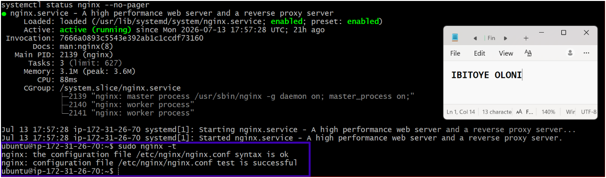

### Notes

Answer the following in your own words:

**1. What proves Nginx is listening on 0.0.0.0:80?**

Write your answer here.

In the process of trying to understand how to know that Nginx is listening, I ran sudo ss -tlnp | grep nginx. The result showed LISTEN 0      128    0.0.0.0:80     *:*    users:(("nginx",pid=1234,fd=6))

This line proves Nginx is bound to all interfaces (0.0.0.0) on port 80.

The most definitive proof is seeing 0.0.0.0:80 in the output of ss or netstat. That shows the kernel has bound Nginx to all interfaces on port 80, meaning it’s reachable from any IP assigned to the VM.
---

**2. What proves SSH is active on port 22?**

Write your answer here.

I also proceeded to run sudo ss -tlnp | grep sshd

The result LISTEN 0      128    0.0.0.0:22     *:*    users:(("sshd",pid=1234,fd=3)), the result showed that the sshd process is bound to port 22 on all interfaces (0.0.0.0).

This shows the kernel has bound SSH to port 22 and it’s ready to accept connections.

**3. Did you find any unexpected open ports? Explain briefly.**

Write your answer here.

From my understanding, on a properly deployed Ubuntu VM with Nginx and SSH as what we did, the only expected open ports are 80 (HTTP for Nginx) and 22 (SSH for remote access). 

If at any point we discover additional ports — such as database ports (3306 for MySQL), cache ports (6379 for Redis), or Docker API ports (2375) — those are considered unexpected, unless we explicitly intended to expose them. Such ports increase the attack surface and should be closed or bound to localhost. 

I ran the command sudo ss -tulnp, and the result lists all TCP/UDP ports and the processes bound to them.

Ultimately, the expected ports on the VM are ports 22 and 80. Optionally 443, if we configured HTTPS with TLS certificates

# Task 2 — Service Health & Systemd Validation (Nginx)

## Goal

Verify that Nginx is properly installed, running, enabled at boot, and safely configured.

### Evidence

#### Screenshot 1 — Output of `systemctl status nginx --no-pager`

Add your screenshot here.

#### Screenshot 2 — Output of `sudo nginx -t`

Add your screenshot here.

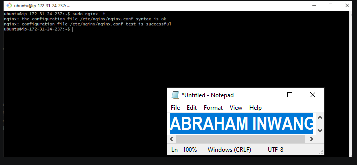

#### Screenshot 3 — Output of `sudo ss -lptn '( sport = :80 )'`

Add your screenshot here.

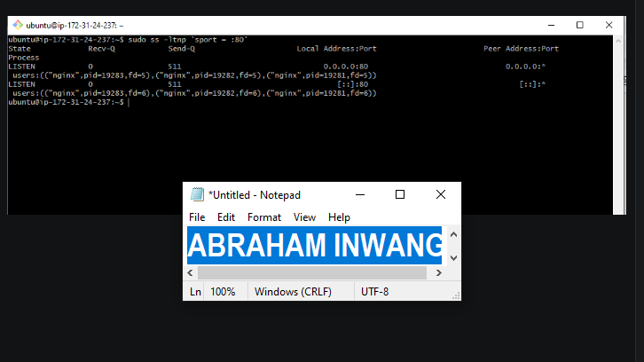

### Notes

Answer the following in your own words:

**1. What happens if Nginx fails to restart in production?**

Write your answer here.

-In simple explanation, if Nginx fails to restart in production, it becomes a serious incident because it directly impacts the ability to serve web traffic.

From the basic understanding, users will see errors like “Connection refused” or “502 Bad Gateway”. Apparently, the React app becomes unreachable over HTTP/HTTPS.

**2. What's your basic rollback plan?**

Write your answer here.
Truthfully, this is exactly the kind of incident DevOps engineers train for — quick diagnosis, rollback, and recovery.

But it is advised that we first run sudo nginx -t to validate the config syntax — this catches most errors before they ever reach a restart. 

If a restart is attempted and fails, the first step is to check systemctl status nginx --no-pager and sudo journalctl -u nginx --no-pager -n 50 to see the exact error.

If a config change caused the failure, revert to the last known good version.

# Task 3 — Logs & Request Trace

## Goal

Verify real traffic flow and analyze logs to understand system behavior and errors.

### Evidence

#### Screenshot 1 — Output of `sudo tail -n 30 /var/log/nginx/access.log`

Add your screenshot here.

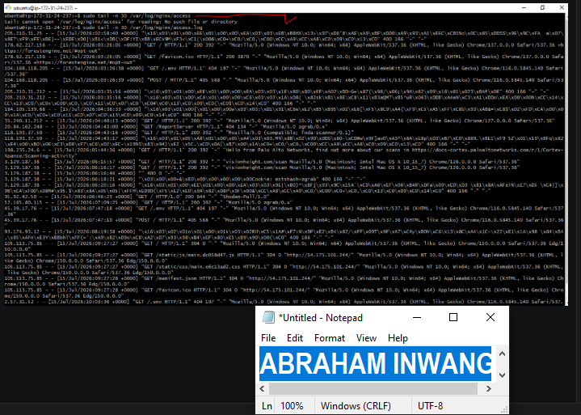

#### Screenshot 2 — Output of `sudo tail -n 30 /var/log/nginx/error.log`

Add your screenshot here.

Note that this doesn't mean the system is permanently error-free, it only reflects that no issues occurred during the time window covered by the log so far

#### Screenshot 3 — Output of `sudo journalctl -u nginx --no-pager -n 50`

Add your screenshot here.

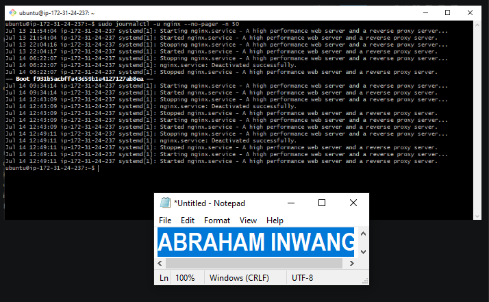

### Notes

Answer the following in your own words:

**1. Were there any errors in the logs?**

- If yes, mention 1–2 example error lines from the logs and explain what each one means in simple terms.
- If no, explain what it means if the error log is empty or shows no recent errors during your check.

Write your answer here.

No errors.

**2. If there were no errors, what does that indicate about the system?**

Write your answer here.

This doesn't mean the system is permanently error-free, it only reflects that no issues occurred during the time window covered by the log so far.

An empty error log and a clean journalctl history indicate that Nginx has not encountered any internal errors, misconfigurations, or failed lifecycle events during the period covered by these logs. 

This is a positive signal about current system health, but it is not a permanent guarantee

**3. Based on the access logs, were your curl requests visible in the log entries? What does that prove about traffic flow?**

Write your answer here.

The curl request appeared in access.log as a GET / request from the server's own public IP with a 200 status and the user agent curl/8.18.0. 

This confirms the full traffic path is working end-to-end: the request left the client, traveled through the network, reached Nginx, was processed and served correctly, and was logged — proving there's no break anywhere in that chain.

# Task 4 — System Resource Health Check (Capacity Red Flags)

## Goal

Assess server capacity and detect potential performance or failure risks.

### Evidence

#### Screenshot 1 — Output of `uptime`

Add your screenshot here.

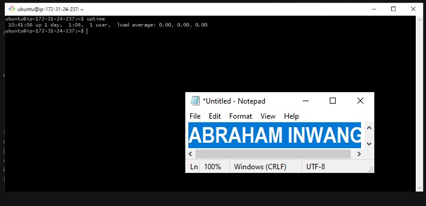

#### Screenshot 2 — Output of `free -h`

Add your screenshot here.

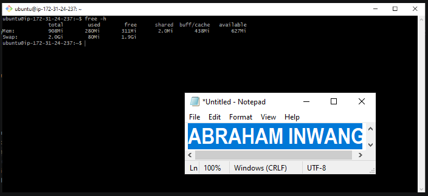

#### Screenshot 3 — Output of `df -h`

Add your screenshot here.

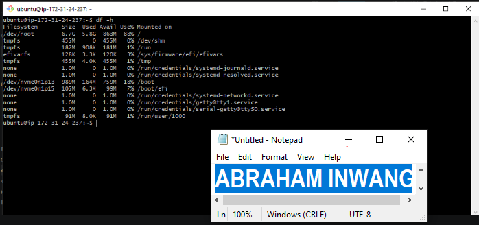

#### Screenshot 4 — Output of `sudo du -sh /var/* | sort -h`

Add your screenshot here.

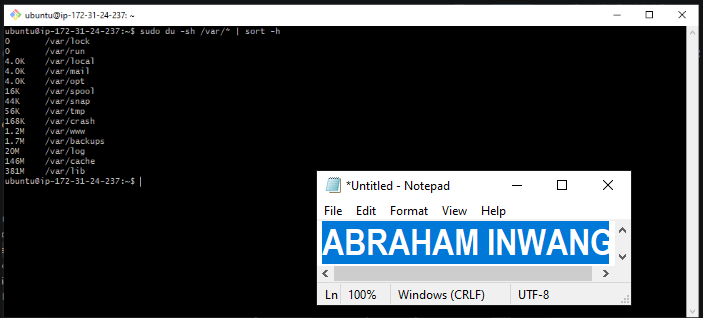

### Notes

Answer the following in your own words:

**1. Which resource looks most critical right now? (CPU/load, memory, or disk) Explain why.**

Write your answer here.

If I had to choose which resource needs the most consistent monitoring as the server grows, it would be disk usage. 

Unlike CPU or memory, which usually show clear signs of strain through slower performance, disk space tends to fill up quietly. Logs, cached packages, or leftover files can accumulate without obvious warning, and the system may suddenly hit a critical limit. 

That makes disk the resource most likely to surprise you if it isn’t watched closely.

**2. What happens if disk becomes 100% full in a production server?**

Write your answer here.

Thinking off the top of my head, if a production server’s disk reaches 100% full, it’s one of the most disruptive failures you can face. 

From the angle of Operational Risks,

There will be service downtime → the web app becomes unreachable.

Data corruption → Databases may crash mid‑write, leaving corrupted tables.

Security blind spots → Logs stop, so you lose visibility into attacks or incidents.

Recovery complexity → Fixing requires careful cleanup without deleting critical files.

# Task 5 — Configuration & Deployment Verification

## Goal

Ensure the correct React build is deployed and Nginx is serving it properly.

### Evidence

#### Screenshot 1 — Output of `ls -lah /var/www/html | head -n 20`

Add your screenshot here.

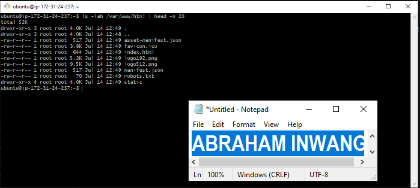

#### Screenshot 2 — Output of `grep -R "Deployed by" -n /var/www/html 2>/dev/null | head`

Add your screenshot here.

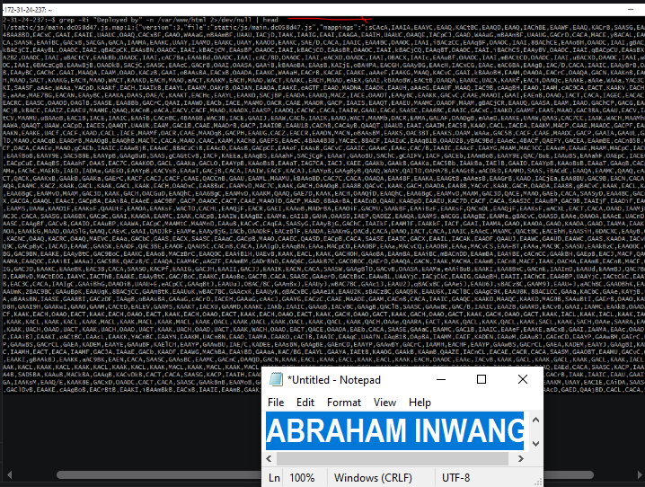

#### Screenshot 3 — Output of `grep -n "try_files" /etc/nginx/sites-available/default`

Add your screenshot here.

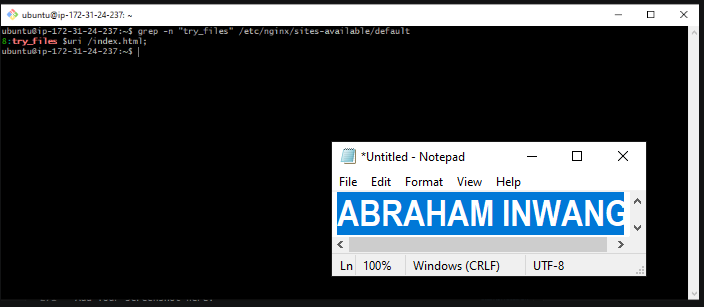

### Notes

Answer the following in your own words:

**1. How do you confirm that the correct version of the application is deployed?**

Write your answer here.

To confirm that the correct version of an application is deployed on the production server, you need to combine file checks, runtime validation, and metadata verification.

Check build artifacts  

Look inside /var/www/html for the React build output (index.html, static/, asset-manifest.json).

Use grep to find deployment tags or version strings:
(grep -Ri "version" /var/www/html 2>/dev/null | head)

grep -n "try_files" confirmed Nginx's config correctly falls back to index.html for unmatched routes, ensuring the SPA behaves correctly for all application routes, not just the homepage.

# Task 6 — Nginx Configuration Failure Simulation

## Goal

Simulate a real-world Nginx misconfiguration and recover the service safely.

### Evidence

#### Screenshot 1 — Output of `sudo nginx -t` showing the syntax error (broken config)

Add your screenshot here.

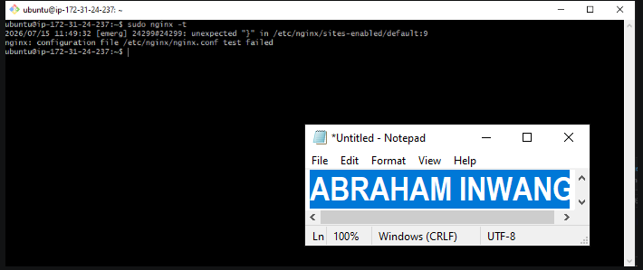

#### Screenshot 2 — Output of `sudo nginx -t` showing syntax ok (fixed config)

Add your screenshot here.

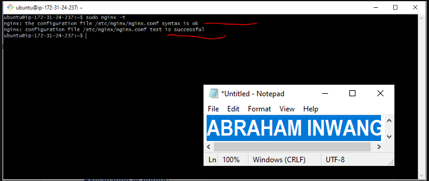

#### Screenshot 3 — Output of `curl -I http://<public-ip>` confirming recovery (200 OK)

Add your screenshot here.

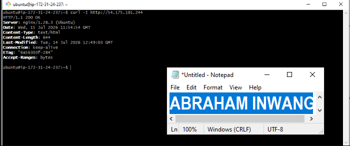

### Notes

Answer the following in your own words:

**1. What caused the configuration failure?**

Write your answer here.

In the Nginx configuration file /etc/nginx/sites-available/default, two semicolons were missing. One was deliberately removed from the try_files $uri /index.html; directive as per instructions, while another was unintentionally absent from the error_page 404 /index.html; line. 

The absence of either semicolon was enough to break Nginx’s ability to parse the server block correctly, resulting in a syntax error.

**2. How did you fix the issue?**

Write your answer here.

I reopened the Nginx configuration file and added back the two missing semicolons. 

After that, I ran sudo nginx -t to verify the syntax was valid. Once the test confirmed the configuration was correct, I restarted the service with systemctl restart nginx. 

Finally, I used an external curl -I request to ensure the application was once again being served properly.

**3. How can you avoid this kind of issue in real production systems?**

Write your answer here.

Firstly, consider using a staging environment to test config changes before they ever touch production.

Keep your Nginx configuration files under Git version control so that if a faulty change is introduced, you can quickly roll back to a verified working state instead of trying to reconstruct the settings from memory.

# Task 7 — Web Application Failure Simulation

## Goal

Simulate missing deployment content and recover the application safely.

### Evidence

#### Screenshot 1 — Output of `curl -I http://<public-ip>` showing failure (non-200 response)

Add your screenshot here.

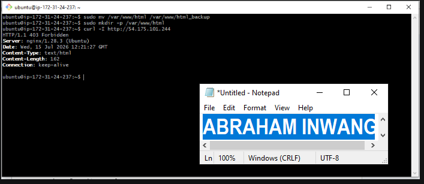

#### Screenshot 2 — Output of `curl -I http://<public-ip>` confirming recovery (200 OK)

Add your screenshot here.

### Notes

Answer the following in your own words:

**1. What caused the application to break in this scenario?**

Write your answer here

The web root directory at /var/www/html — the location Nginx uses to serve content — was cleared of all deployment files. Although Nginx itself continued running with a valid configuration, there was no application content or fallback file available. 

As a result, Nginx returned a 500 Internal Server Error instead of delivering the React app.

**2. How did you fix the issue and restore the application?**

Write your answer here.

Beforehand, the original deployment had been safely preserved by moving it into html_backup instead of deleting it. Recovery was then straightforward: the empty, broken directory was removed, and the backup was restored to /var/www/html. 

Nginx was restarted to ensure it served cleanly from the restored files. Verification was done externally with curl -I, which returned a 200 OK along with identical metadata values (Content-Length, Last-Modified, ETag) compared to the pre‑incident state — confirming that the exact same build was successfully brought back online.

**3. What steps would you take to prevent this kind of issue in real production systems?**

Write your answer here.

Set up automated backups before each deployment, ensuring that any release can be rolled back instantly without requiring manual fixes.

Deploy into a versioned directory and switch a symlink (for example, /var/www/current) to point to the new release. This avoids overwriting the live directory directly, so even if a deployment fails, the active path is never left empty or partially written.

# Task 8 — Security & Reliability Review

## Goal

Review and reflect on the security and reliability practices applied during this assignment.

### Security & Reliability Notes

Answer the following in your own words:

**1. Why is SSH key-based authentication more secure than sharing passwords?**

Write your answer here.

From my current understanding, SSH key‑based authentication is more secure than passwords because the private key never leaves your device, cannot be brute‑forced like human‑memorable passwords, and the server only stores the public key, which is useless to attackers if leaked. 

In production, this eliminates entire categories of password attacks such as brute force, phishing, and credential reuse.

**2. Why should only required ports be open on a production server?**

Write your answer here.
This is important that only keeping the required ports open on a production server is a fundamental security practice because every open port is a potential doorway into your system.

 Each open port exposes a service that attackers can probe for vulnerabilities.

 Services listening on unused ports may allow unintended logins or remote execution.

 Extra services consume CPU, memory, and disk, reducing efficiency
---

**3. Why is it important for Nginx to be enabled on boot?**

Write your answer here.

From my understanding, it is important to have Nginx enabled on boot because production servers must recover automatically after reboots or crashes without requiring manual intervention.

**4. What are the risks of sharing secrets, keys, or credentials publicly?**

Write your answer here.

Sharing secrets, keys, or credentials publicly is one of the most dangerous mistakes in system administration because it gives attackers direct access to your infrastructure.

API keys or tokens can be abused to send spam, mine cryptocurrency, or rack up huge bills on cloud services.

Sensitive customer or business data can be stolen, leading to compliance violations and reputational damage.

**5. Why should cloud resources be stopped or terminated when they are no longer needed?**

Write your answer here.

Stopping or terminating cloud resources when they’re no longer needed is critical for both security and cost management. 

Leaving unused resources running creates unnecessary risks and wastes money.

# LinkedIn Post (Required)

## Evidence

#### LinkedIn Post URL

Paste your LinkedIn post URL here:

`__________________________`

https://www.linkedin.com/posts/abraham-inwang-695a67216_todays-real-life-task-deploy-a-react-share-7482784747207786496-C6d8/?utm_source=share&utm_medium=member_desktop&rcm=ACoAADaeMREBp9wR-dEl9T_L6Ru07p5uCgcZniE

#### Screenshot — Published LinkedIn post

Add your screenshot here.

[LinkedIn]
(image-37.png)

# Submission Instructions

- Add all required screenshots in your submission
- Full name must be visible in required screenshots
- Do not expose sensitive information (keys, passwords, account IDs)

---

# Completion Checklist

- [ ] Task 1: Screenshots (browser, ip a, ss -tulpen, ufw status) + Notes answered
- [ ] Task 2: Screenshots (nginx status, nginx -t, ss port 80) + Notes answered
- [ ] Task 3: Screenshots (access log, error log, journalctl) + Notes answered
- [ ] Task 4: Screenshots (uptime, free -h, df -h, du -sh) + Notes answered
- [ ] Task 5: Screenshots (ls html, grep deployed by, grep try_files) + Notes answered
- [ ] Task 6: Screenshots (nginx -t fail, nginx -t pass, curl recovery) + Notes answered
- [ ] Task 7: Screenshots (curl failure, curl recovery) + Notes answered
- [ ] Task 8: Security & Reliability Notes answered
- [ ] LinkedIn post published and URL submitted
- [ ] Full Name visible in all required screenshots
- [ ] No sensitive data exposed

---

## 📌 About DMI & CloudAdvisory

DevOps Micro Internship (DMI) is a project-based DevOps program run by Pravin Mishra (The CloudAdvisory) focused on real-world execution, systems thinking, and career readiness.

It helps learners build strong DevOps foundations with hands-on experience.

---

## 📌 Resources

- 🌐 DMI Official Website: https://pravinmishra.com/dmi  
- 🎓 DevOps for Beginners (Udemy): https://www.udemy.com/course/devops-for-beginners-docker-k8s-cloud-cicd-4-projects/  
- 🎓 Agentic AI DevOps with Claude Code: https://www.udemy.com/course/ultimate-agentic-ai-devops-with-claude-code/  
- 🎓 DevOps with Claude Code: Terraform, EKS, ArgoCD & Helm: https://www.udemy.com/course/devops-with-claude-code-terraform-eks-argocd-helm/  
- ▶️ YouTube Playlist: https://www.youtube.com/playlist?list=PLFeSNDtI4Cho  
- 🔗 Pravin Mishra (LinkedIn): https://www.linkedin.com/in/pravin-mishra-aws-trainer/  
- 🏢 CloudAdvisory (LinkedIn): https://www.linkedin.com/company/thecloudadvisory/

---

*This submission is part of DevOps Micro Internship (DMI) Cohort 3 — Agentic AI Track.*