# Assignment 3 — Production Maintenance Drill (OPS Checklist)

Part of the DevOps Micro Internship (DMI) Cohort 3 with Agentic AI

---

## Purpose

In this assignment, you will treat your already deployed React application (on Ubuntu VM with Nginx) as a live production system. You will perform structured operational checks covering network validation, service health, log analysis, resource monitoring, configuration verification, and incident simulation with recovery — mirroring real on-call DevOps responsibilities.

---

# Task 1 — Server Access & Networking Validation

## Goal

Verify that the deployed React application is reachable from the browser and confirm basic network connectivity of the Ubuntu VM.

### Evidence

#### Screenshot 1 — Browser showing the React app with your Full Name visible on the UI

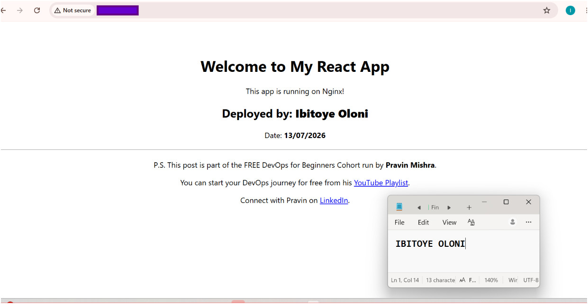

---

#### Screenshot 2 — Output of `ip a`

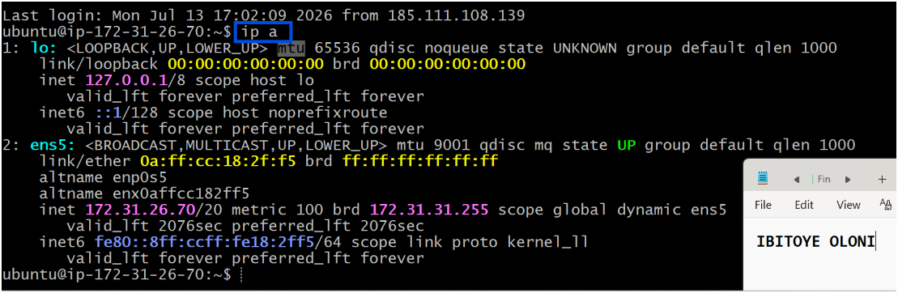

---

#### Screenshot 3 — Output of `sudo ss -tulpen`

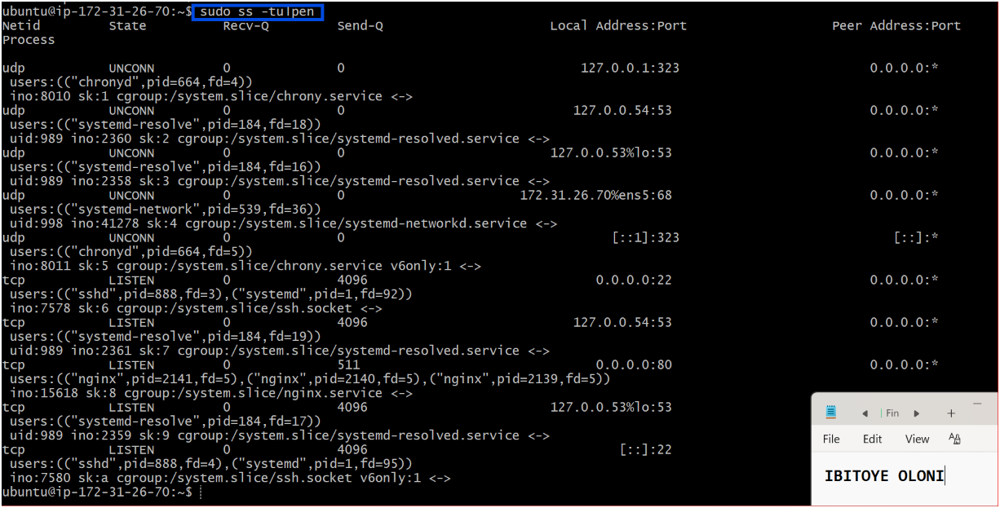

---

#### Screenshot 4 — Output of `sudo ufw status`

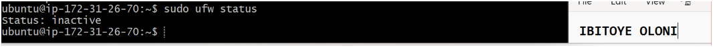

---

### Notes

Answer the following in your own words:

Nginx is configured to listen for HTTP traffic on port 80. This can be verified by running the following command:

sudo ss -tulnp | grep :80

The output shows that the Nginx process is listening on 0.0.0.0:80, which confirms that it is accepting HTTP connections on port 80 from all available IPv4 network interfaces.

---

**2. What proves SSH is active on port 22?**

SSH is configured to listen for incoming traffic on port 22. This can be verified by running the following command:

sudo ss -tulnp | grep :22

The output shows that the SHH process is listening on 0.0.0.0:22, which confirms that it is accepting TCP/IP connections on port 22 from all available IPv4 network interfaces.

---

**3. Did you find any unexpected open ports? Explain briefly.**

Yes. By running sudo ss -tulnp, I noticed some expected ports are also opening - ports 323,53,68,53. Although, they are all for internal communication within the VPC and cannot be reached from outside the VPC.

---

# Task 2 — Service Health & Systemd Validation (Nginx)

## Goal

Verify that Nginx is properly installed, running, enabled at boot, and safely configured.

### Evidence

#### Screenshot 1 — Output of `systemctl status nginx --no-pager`

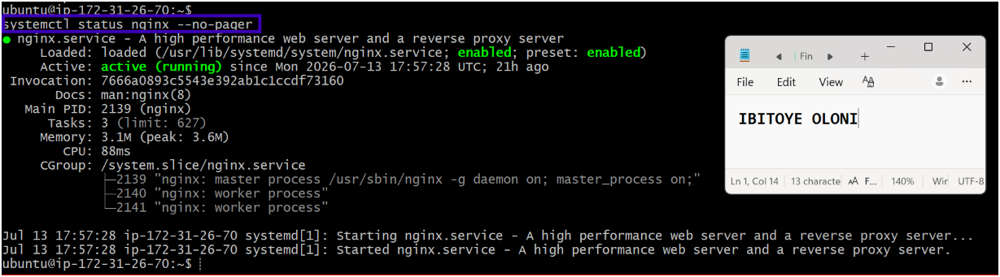

---

#### Screenshot 2 — Output of `sudo nginx -t`

---

#### Screenshot 3 — Output of `sudo ss -lptn '( sport = :80 )'`

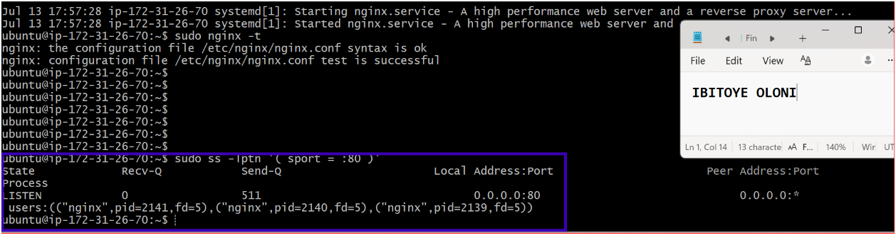

---

### Notes

Answer the following in your own words:

**1. What happens if Nginx fails to restart in production?**

If Nginx fails to restart, the website will become unavailable and users won't be able to access it. I would check the Nginx configuration and error logs, fix the issue, and restart the service as quickly as possible.

---

**2. What's your basic rollback plan?**

If something goes wrong, I'll restore the last working Nginx configuration, test it with sudo nginx -t, restart Nginx, and make sure the website is working again.

---

# Task 3 — Logs & Request Trace

## Goal

Verify real traffic flow and analyze logs to understand system behavior and errors.

### Evidence

#### Screenshot 1 — Output of `sudo tail -n 30 /var/log/nginx/access.log`

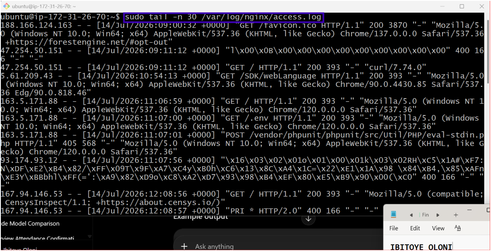

---

#### Screenshot 2 — Output of `sudo tail -n 30 /var/log/nginx/error.log`

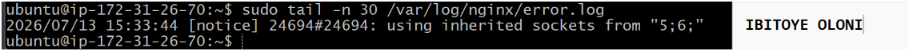

---

#### Screenshot 3 — Output of `sudo journalctl -u nginx --no-pager -n 50`

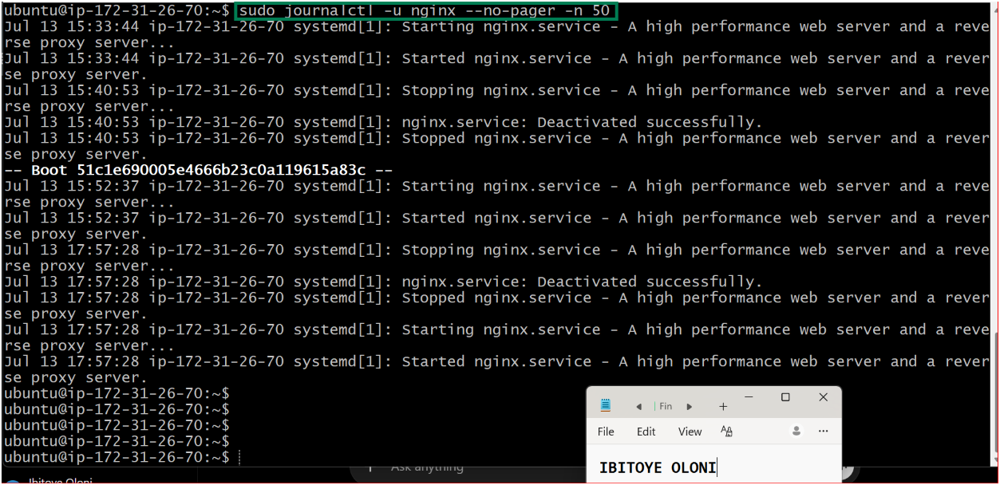

---

### Notes

Answer the following in your own words:

**1. Were there any errors in the logs?**

- If yes, mention 1–2 example error lines from the logs and explain what each one means in simple terms.
- If no, explain what it means if the error log is empty or shows no recent errors during your check.

The command, (sudo tail -n 30 /var/log/nginx/error.log) returned no result indicating that there is no error.

---

**2. If there were no errors, what does that indicate about the system?**

It means everything is fine - Nginx hasn't experienced any internal errors, no crashes, no config issues or failed upstreams.

---

**3. Based on the access logs, were your curl requests visible in the log entries? What does that prove about traffic flow?**

Yes, my curl requests were visible in the Nginx access logs. This proves that the requests reached the Nginx server successfully, were processed, and the server returned a response, confirming that traffic is flowing correctly between the client and the web server.

---

# Task 4 — System Resource Health Check (Capacity Red Flags)

## Goal

Assess server capacity and detect potential performance or failure risks.

### Evidence

#### Screenshot 1 — Output of `uptime`

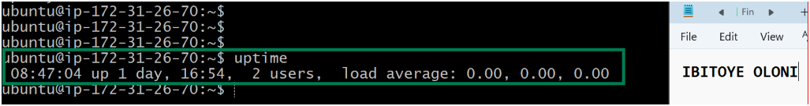

---

#### Screenshot 2 — Output of `free -h`

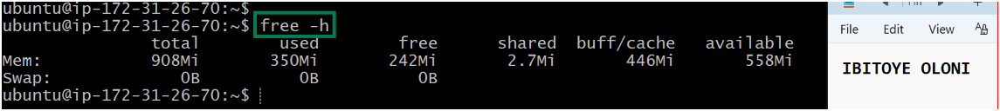

---

#### Screenshot 3 — Output of `df -h`

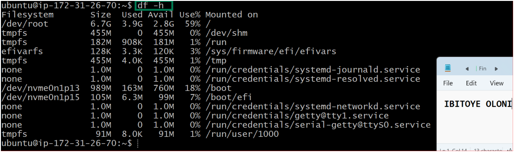

---

#### Screenshot 4 — Output of `sudo du -sh /var/* | sort -h`

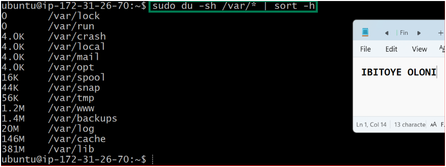

---

### Notes

Answer the following in your own words:

**1. Which resource looks most critical right now? (CPU/load, memory, or disk) Explain why.**

The **disk** looks the most critical because it has the highest usage at 59%, while the CPU load is 0.00 and there is still plenty of available memory. 

---

**2. What happens if disk becomes 100% full in a production server?**

If the disk becomes 100% full, the server can start having problems. Applications may not be able to save data or write logs, users might see errors, and some services could stop working until enough disk space is available again.

---

# Task 5 — Configuration & Deployment Verification

## Goal

Ensure the correct React build is deployed and Nginx is serving it properly.

### Evidence

#### Screenshot 1 — Output of `ls -lah /var/www/html | head -n 20`

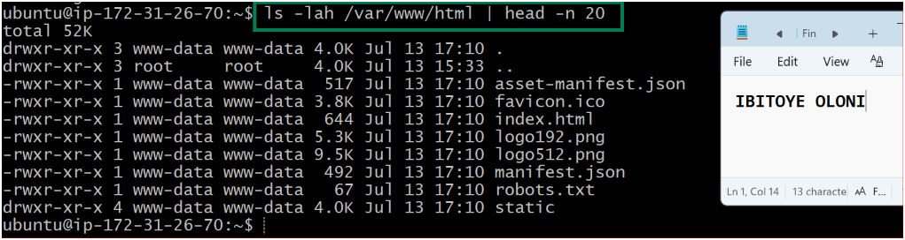

---

#### Screenshot 2 — Output of `grep -R "Deployed by" -n /var/www/html 2>/dev/null | head`

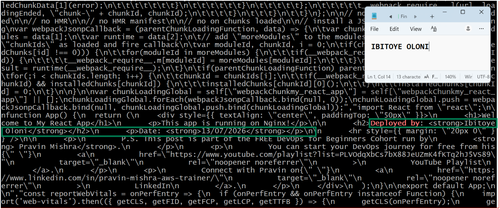

---

#### Screenshot 3 — Output of `grep -n "try_files" /etc/nginx/sites-available/default`

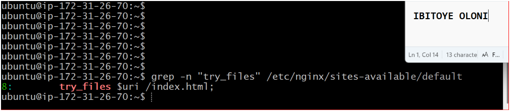

---

### Notes

Answer the following in your own words:

**1. How do you confirm that the correct version of the application is deployed?**

I confirm the correct version is deployed by opening the application in a web browser and checking that the latest changes, such as the **"Deployed by"** message, are displayed. I can also use `grep` to verify that the updated text exists in the deployed files.

---

# Task 6 — Nginx Configuration Failure Simulation

## Goal

Simulate a real-world Nginx misconfiguration and recover the service safely.

### Evidence

#### Screenshot 1 — Output of `sudo nginx -t` showing the syntax error (broken config)

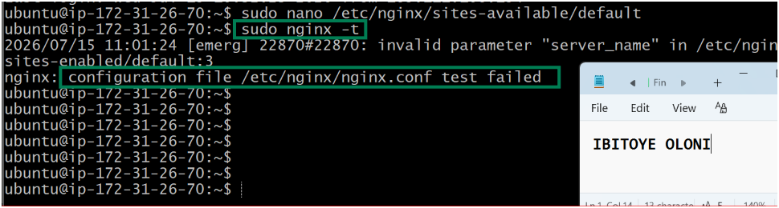

---

#### Screenshot 2 — Output of `sudo nginx -t` showing syntax ok (fixed config)

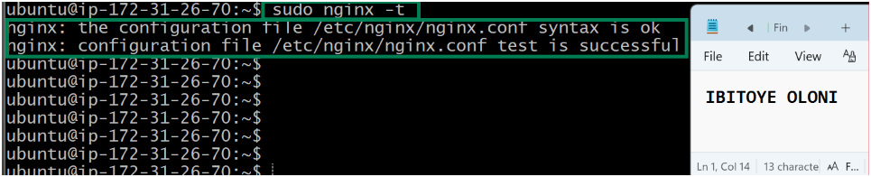

---

#### Screenshot 3 — Output of `curl -I http://<public-ip>` confirming recovery (200 OK)

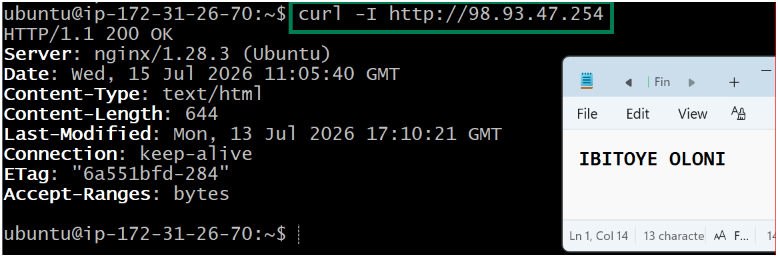

---

### Notes

Answer the following in your own words:

**1. What caused the configuration failure?**

A semi-colon was removed on the configuration file at /etc/nginx/sites-available/default.

---

**2. How did you fix the issue?**

After confirming the failure with command sudo nginx -t, I logge back to the configuration file made the change, saved the file and ran the command "sudo nginx -t " to confirm the configuration file is okay.

---

**3. How can you avoid this kind of issue in real production systems?**

Always test the Nginx configuration with sudo nginx -t before restarting or reloading the service. This helps catch configuration errors before they affect the live website.

---

# Task 7 — Web Application Failure Simulation

## Goal

Simulate missing deployment content and recover the application safely.

### Evidence

#### Screenshot 1 — Output of `curl -I http://<public-ip>` showing failure (non-200 response)

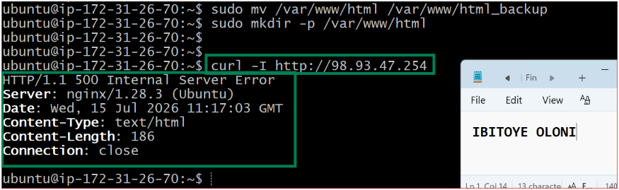

---

#### Screenshot 2 — Output of `curl -I http://<public-ip>` confirming recovery (200 OK)

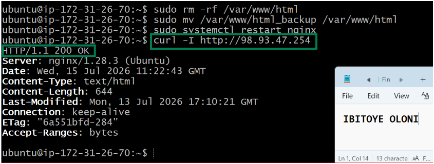

---

### Notes

Answer the following in your own words:

**1. What caused the application to break in this scenario?**

The configuration files content was moved away as a backup to another location. So, the configuration file was empty at this point

---

**2. How did you fix the issue and restore the application?**

The configuration file content was copied back from the backup file, and nginx was restarted.

---

**3. What steps would you take to prevent this kind of issue in real production systems?**

I would always back up the configuration before making changes, test it first, and verify everything is working before deploying it. This helps avoid downtime if something goes wrong

---

# Task 8 — Security & Reliability Review

## Goal

Review and reflect on the security and reliability practices applied during this assignment.

### Security & Reliability Notes

Answer the following in your own words:

**1. Why is SSH key-based authentication more secure than sharing passwords?**

SSH is a secure protocol and SSH keys are much harder to guess or steal than passwords, making it a safer way to access a server.

---

**2. Why should only required ports be open on a production server?**

Keeping only the necessary ports open reduces security risks and makes it harder for attackers to access the server.

---

**3. Why is it important for Nginx to be enabled on boot?**

It ensures the website starts automatically after a reboot, so users can access it without manual intervention.

---

**4. What are the risks of sharing secrets, keys, or credentials publicly?**

Anyone who gets access to them could log in to your systems, steal data, or misuse your cloud resources.

---

**5. Why should cloud resources be stopped or terminated when they are no longer needed?**

It helps avoid unnecessary charges and keeps your cloud environment clean and easier to manage.

---

# LinkedIn Post (Required)

## Evidence

#### LinkedIn Post URL

Paste your LinkedIn post URL here:

https://www.linkedin.com/posts/ibitoye-oloni_devops-aws-linux-share-7483576101680783360-2p22/?utm_source=share&utm_medium=member_desktop&rcm=ACoAAABp_1YBcUgsxYJIdRCX9CFvm17K_adeV6E

---

#### Screenshot — Published LinkedIn post

---

# Submission Instructions

- Add all required screenshots in your submission
- Full name must be visible in required screenshots
- Do not expose sensitive information (keys, passwords, account IDs)

---

# Completion Checklist

- [ ] Task 1: Screenshots (browser, ip a, ss -tulpen, ufw status) + Notes answered
- [ ] Task 2: Screenshots (nginx status, nginx -t, ss port 80) + Notes answered
- [ ] Task 3: Screenshots (access log, error log, journalctl) + Notes answered
- [ ] Task 4: Screenshots (uptime, free -h, df -h, du -sh) + Notes answered
- [ ] Task 5: Screenshots (ls html, grep deployed by, grep try_files) + Notes answered
- [ ] Task 6: Screenshots (nginx -t fail, nginx -t pass, curl recovery) + Notes answered
- [ ] Task 7: Screenshots (curl failure, curl recovery) + Notes answered
- [ ] Task 8: Security & Reliability Notes answered
- [ ] LinkedIn post published and URL submitted
- [ ] Full Name visible in all required screenshots
- [ ] No sensitive data exposed

---

## 📌 About DMI & CloudAdvisory

DevOps Micro Internship (DMI) is a project-based DevOps program run by Pravin Mishra (The CloudAdvisory) focused on real-world execution, systems thinking, and career readiness.

It helps learners build strong DevOps foundations with hands-on experience.

---

## 📌 Resources

- 🌐 DMI Official Website: https://pravinmishra.com/dmi  
- 🎓 DevOps for Beginners (Udemy): https://www.udemy.com/course/devops-for-beginners-docker-k8s-cloud-cicd-4-projects/  
- 🎓 Agentic AI DevOps with Claude Code: https://www.udemy.com/course/ultimate-agentic-ai-devops-with-claude-code/  
- 🎓 DevOps with Claude Code: Terraform, EKS, ArgoCD & Helm: https://www.udemy.com/course/devops-with-claude-code-terraform-eks-argocd-helm/  
- ▶️ YouTube Playlist: https://www.youtube.com/playlist?list=PLFeSNDtI4Cho  
- 🔗 Pravin Mishra (LinkedIn): https://www.linkedin.com/in/pravin-mishra-aws-trainer/  
- 🏢 CloudAdvisory (LinkedIn): https://www.linkedin.com/company/thecloudadvisory/

---

*This submission is part of DevOps Micro Internship (DMI) Cohort 3 — Agentic AI Track.*