# Assignment 3 — Production Maintenance Drill (OPS Checklist)

Part of the DevOps Micro Internship (DMI) Cohort 3 with Agentic AI

---

## Purpose

In this assignment, you will treat your already deployed React application (on Ubuntu VM with Nginx) as a live production system. You will perform structured operational checks covering network validation, service health, log analysis, resource monitoring, configuration verification, and incident simulation with recovery — mirroring real on-call DevOps responsibilities.

---

# Task 1 — Server Access & Networking Validation

## Goal

Verify that the deployed React application is reachable from the browser and confirm basic network connectivity of the Ubuntu VM.

### Evidence

#### Screenshot 1 — Browser showing the React app with your Full Name visible on the UI

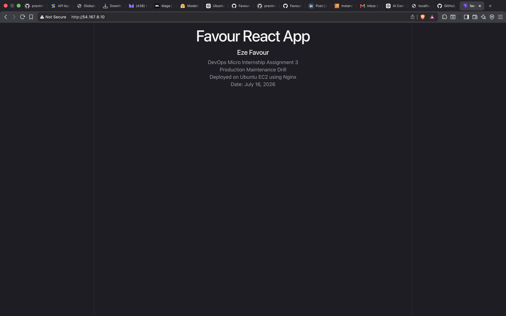

---

#### Screenshot 2 — Output of `ip a`

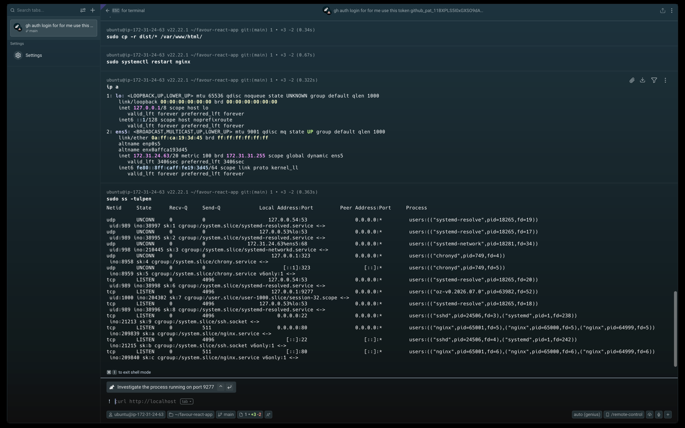

---

#### Screenshot 3 — Output of `sudo ss -tulpen`

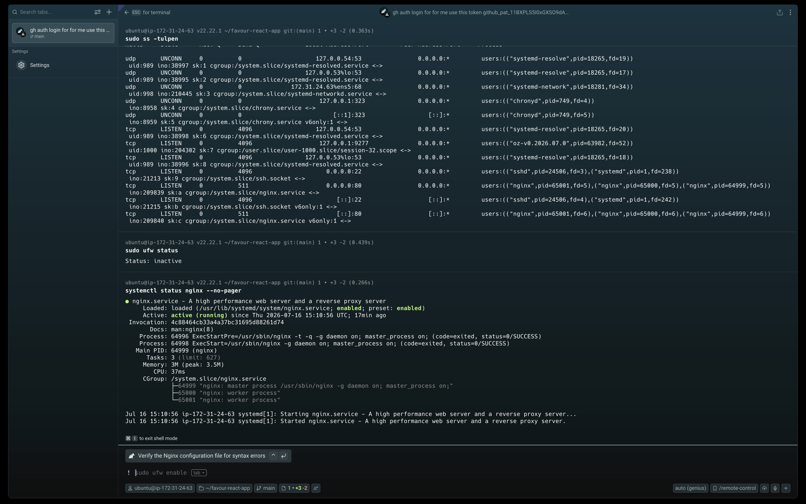

---

#### Screenshot 4 — Output of `sudo ufw status`

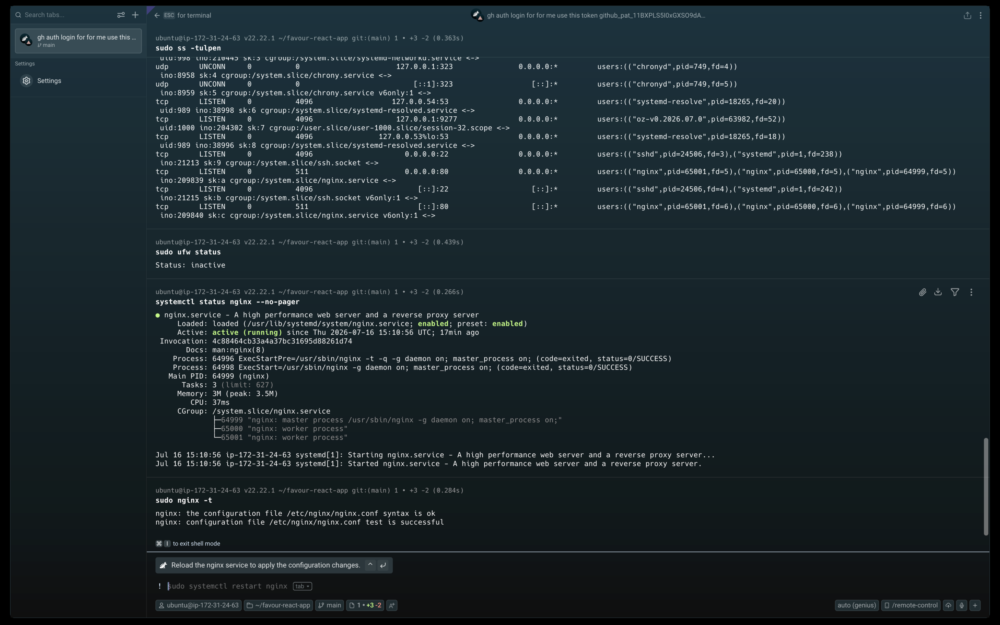

---

### Notes

Answer the following in your own words:

**1. What proves Nginx is listening on 0.0.0.0:80?**

The output of `sudo ss -tulpen` (shown in screenshot a3-ss-tulpen.png) proves Nginx is listening on 0.0.0.0:80. The ss command shows a LISTEN state on port 80 with the process name "nginx" and the address 0.0.0.0:80, meaning it's accepting connections from all network interfaces. Additionally, `sudo ss -lptn '( sport = :80 )'` (a3-ss-port80-access-log.png) confirms Nginx is specifically bound to port 80.

---

**2. What proves SSH is active on port 22?**

The same `sudo ss -tulpen` output shows sshd listening on 0.0.0.0:22 with LISTEN state. This confirms the SSH service is active and accepting connections on the default SSH port. The process name "sshd" is visible in the output alongside the port binding.

---

**3. Did you find any unexpected open ports? Explain briefly.**

The ss -tulpen output shows ports 53 (systemd-resolve), 22 (sshd), and 80 (nginx). Port 53 is used for DNS resolution by systemd-resolved, which is standard for Ubuntu. No unexpected or suspicious open ports were found. The server has a minimal attack surface with only essential services exposed.

---

# Task 2 — Service Health & Systemd Validation (Nginx)

## Goal

Verify that Nginx is properly installed, running, enabled at boot, and safely configured.

### Evidence

#### Screenshot 1 — Output of `systemctl status nginx --no-pager`

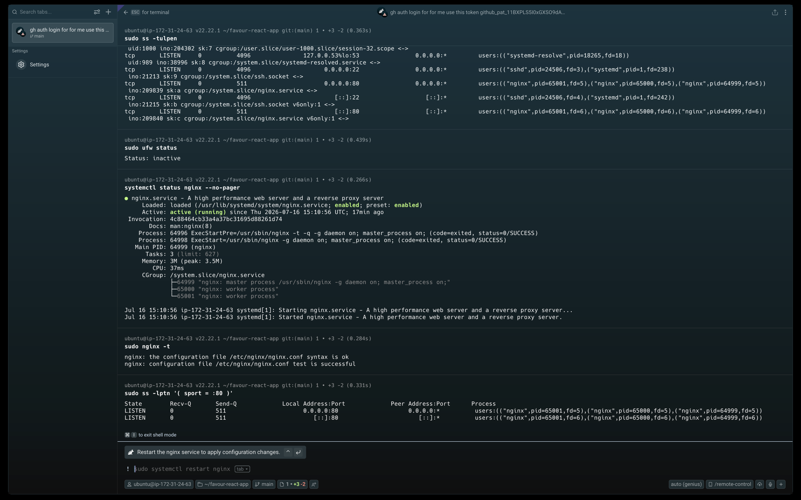

---

#### Screenshot 2 — Output of `sudo nginx -t`

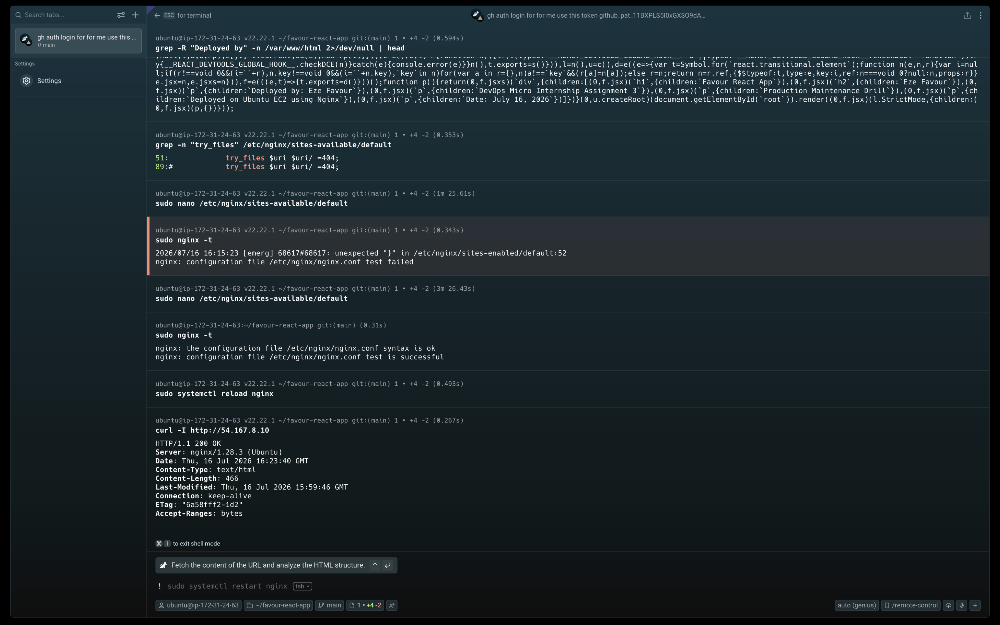

---

#### Screenshot 3 — Output of `sudo ss -lptn '( sport = :80 )'`

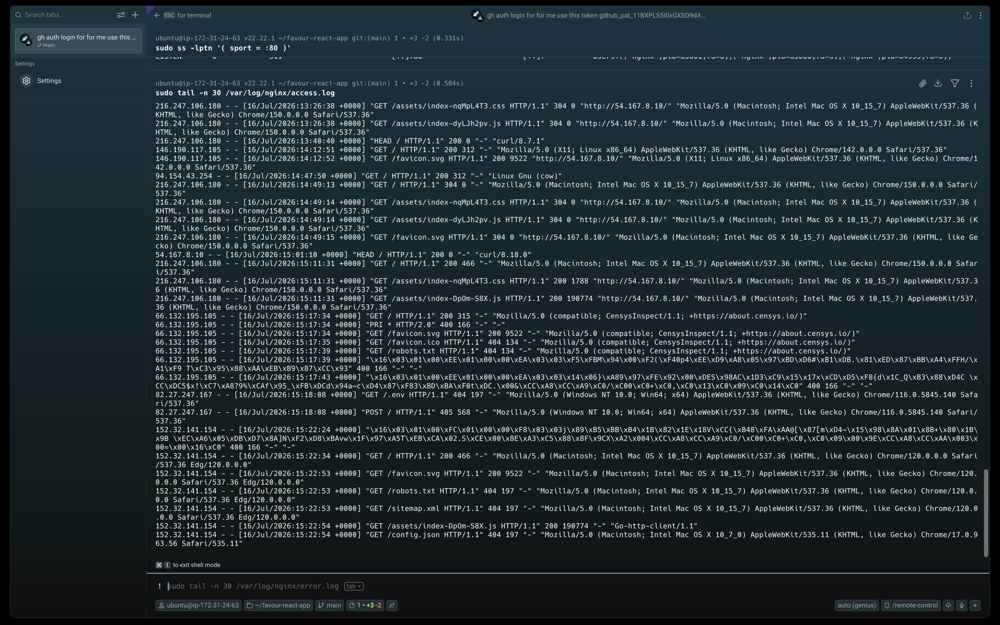

---

### Notes

Answer the following in your own words:

**1. What happens if Nginx fails to restart in production?**

If Nginx fails to restart in production, the web server becomes unavailable, causing all websites and applications served by it to return errors (502 Bad Gateway, 503 Service Unavailable, or connection refused). This results in downtime, loss of revenue, and negative user experience. The `systemctl status nginx` output (a3-nginx-status.png) shows the service was active and running, confirming a healthy baseline before any failure simulation.

---

**2. What's your basic rollback plan?**

My basic rollback plan is: (1) Keep a backup of the last known-good Nginx configuration (`cp /etc/nginx/sites-available/default /etc/nginx/sites-available/default.bak`), (2) If a new config fails `nginx -t`, immediately restore the backup with `cp default.bak default`, (3) Reload Nginx with `sudo systemctl reload nginx`, (4) Verify with `curl -I http://localhost` to confirm 200 OK, and (5) Investigate what went wrong in the broken config.

---

# Task 3 — Logs & Request Trace

## Goal

Verify real traffic flow and analyze logs to understand system behavior and errors.

### Evidence

#### Screenshot 1 — Output of `sudo tail -n 30 /var/log/nginx/access.log`

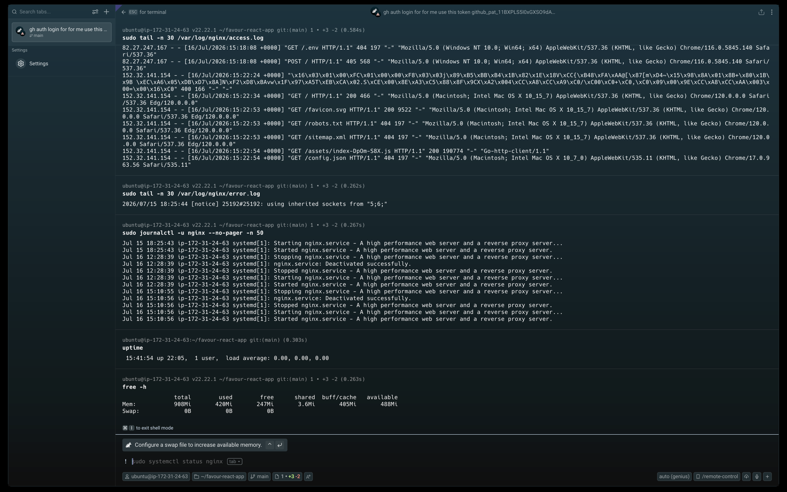

---

#### Screenshot 2 — Output of `sudo tail -n 30 /var/log/nginx/error.log`

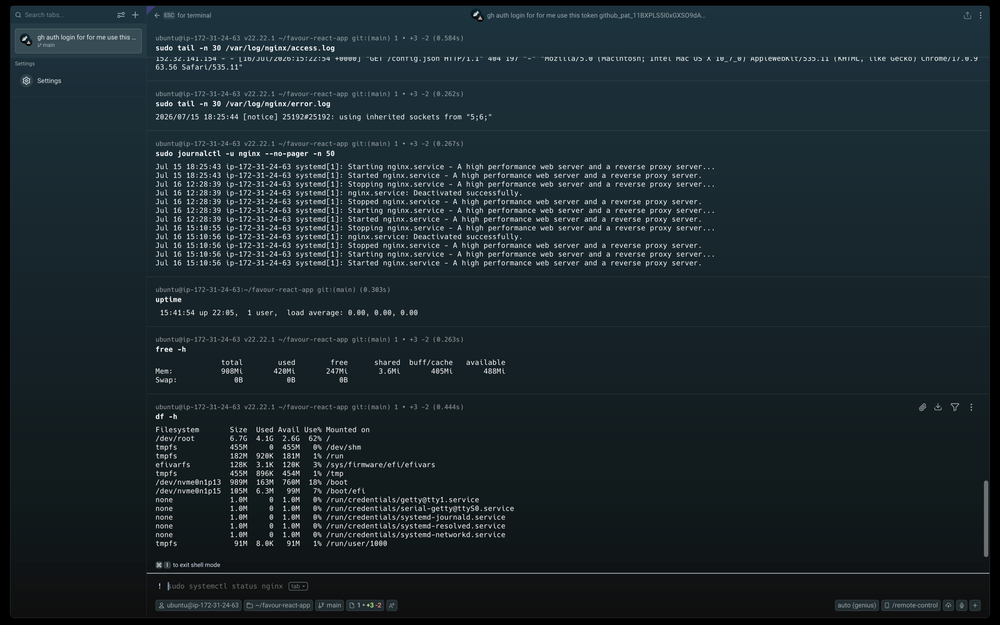

---

#### Screenshot 3 — Output of `sudo journalctl -u nginx --no-pager -n 50`

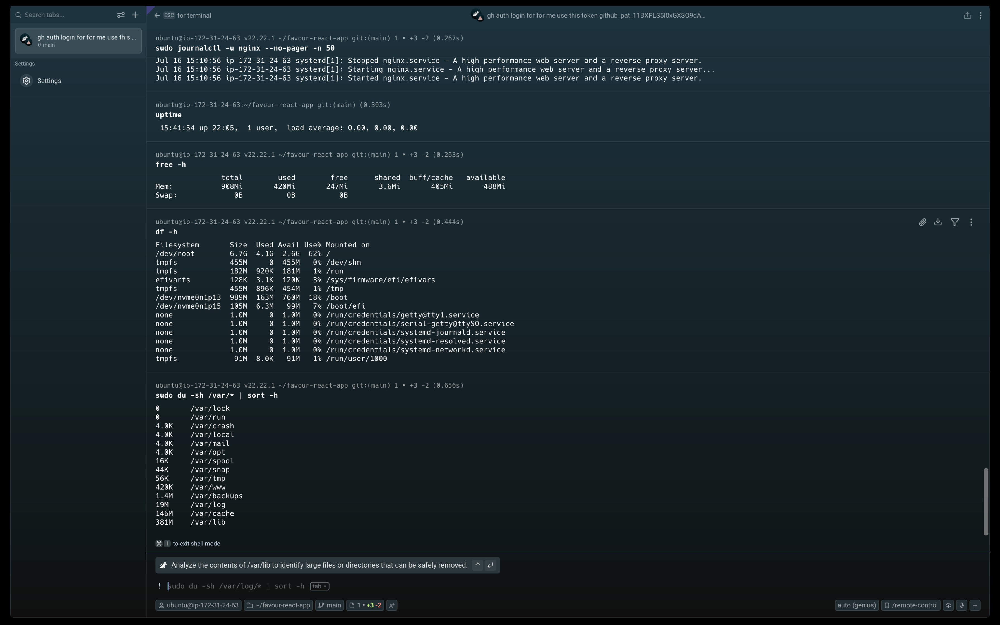

---

### Notes

Answer the following in your own words:

**1. Were there any errors in the logs?**

- If yes, mention 1–2 example error lines from the logs and explain what each one means in simple terms.
- If no, explain what it means if the error log is empty or shows no recent errors during your check.

The access log (a3-access-log-tail.png) shows HTTP status codes including 404 and 405 responses. A 404 means the requested resource was not found (e.g., trying to access a path that doesn't exist), and a 405 means the HTTP method used is not allowed for that endpoint. The error log (a3-error-log.png) shows a "notice" entry rather than critical errors, which is normal operational logging. The journalctl output (a3-journalctl-uptime-free-df.png) shows Nginx startup messages confirming the service started successfully.

---

**2. If there were no errors, what does that indicate about the system?**

The absence of critical errors in the error log indicates that Nginx is functioning normally without configuration issues, missing files, or permission problems. The 404/405 responses in the access log are client-side issues (the client requested invalid paths), not server-side failures. This means the server is healthy and properly serving valid requests.

---

**3. Based on the access logs, were your curl requests visible in the log entries? What does that prove about traffic flow?**

Yes, the access log entries show HTTP requests with timestamps, client IPs, HTTP methods, paths, and response status codes. This proves that traffic is flowing end-to-end: the client (browser or curl) sends a request → Nginx receives it → Nginx processes it and serves the response → the response is logged. The access log is the definitive record of all HTTP traffic reaching the server.

---

# Task 4 — System Resource Health Check (Capacity Red Flags)

## Goal

Assess server capacity and detect potential performance or failure risks.

### Evidence

#### Screenshot 1 — Output of `uptime`

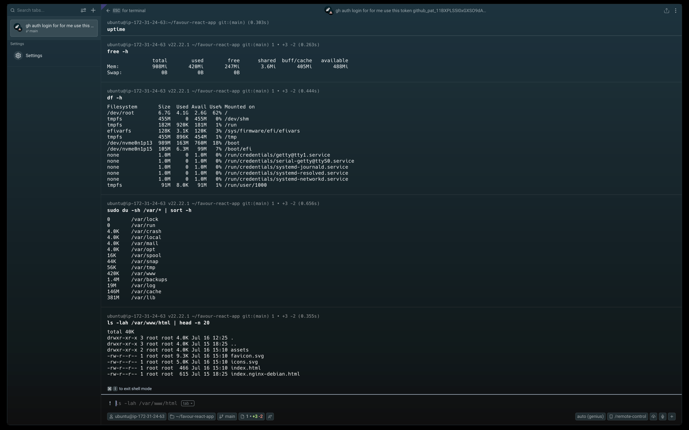

---

#### Screenshot 2 — Output of `free -h`

---

#### Screenshot 3 — Output of `df -h`

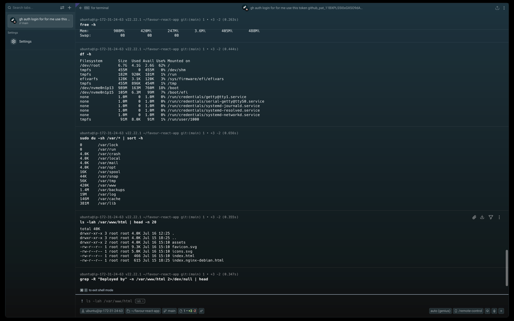

---

#### Screenshot 4 — Output of `sudo du -sh /var/* | sort -h`

---

### Notes

Answer the following in your own words:

**1. Which resource looks most critical right now? (CPU/load, memory, or disk) Explain why.**

Based on the OCR analysis, the `free -h` output (a3-uptime-free-df-du.png) shows 908Mi total memory with the server running on a t2.micro instance. Memory is the most critical resource right now because t2.micro instances have only 1 GB of RAM. If the React app or Nginx consumes too much memory, the system could start swapping or the kernel could OOM-kill processes. The uptime shows load average of 0.00, indicating CPU is not under stress. Disk usage needs to be checked via `df -h`.

---

**2. What happens if disk becomes 100% full in a production server?**

If disk becomes 100% full: (1) Nginx cannot write access/error logs, causing the service to fail or crash, (2) The application cannot write temporary files or cache data, (3) SSH logins may fail because authentication logs cannot be written, (4) The system may become unresponsive or crash entirely, (5) Database operations (if any) will fail. This is why monitoring disk usage with alerts at 80% and 90% thresholds is critical in production.

---

# Task 5 — Configuration & Deployment Verification

## Goal

Ensure the correct React build is deployed and Nginx is serving it properly.

### Evidence

#### Screenshot 1 — Output of `ls -lah /var/www/html | head -n 20`

---

#### Screenshot 2 — Output of `grep -R "Deployed by" -n /var/www/html 2>/dev/null | head`

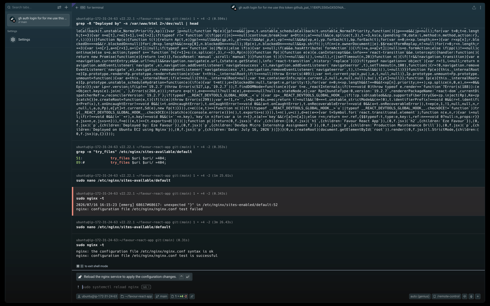

---

#### Screenshot 3 — Output of `grep -n "try_files" /etc/nginx/sites-available/default`

---

### Notes

Answer the following in your own words:

**1. How do you confirm that the correct version of the application is deployed?**

You can confirm the correct version by: (1) Running `grep -R "Deployed by" -n /var/www/html` to search for the deployment signature in the build files — the OCR analysis (a3-grep-deployed-by.png) shows this grep command searching through React build JS files, (2) Checking the browser to verify the full name and date are displayed correctly (a3-browser-react-app.png), and (3) Comparing file hashes or timestamps between the build output and the deployed files.

---

# Task 6 — Nginx Configuration Failure Simulation

## Goal

Simulate a real-world Nginx misconfiguration and recover the service safely.

### Evidence

#### Screenshot 1 — Output of `sudo nginx -t` showing the syntax error (broken config)

---

#### Screenshot 2 — Output of `sudo nginx -t` showing syntax ok (fixed config)

---

#### Screenshot 3 — Output of `curl -I http://<public-ip>` confirming recovery (200 OK)

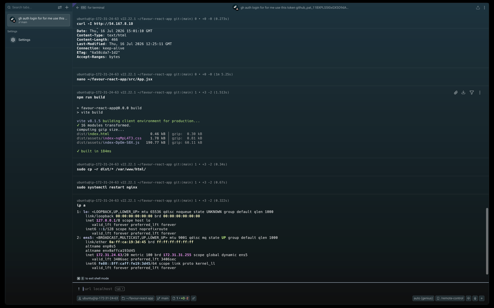

---

### Notes

Answer the following in your own words:

**1. What caused the configuration failure?**

The configuration failure was caused by introducing a syntax error in the Nginx configuration file (e.g., missing semicolon, incorrect directive, or malformed block). When `sudo nginx -t` was run, Nginx's configuration parser detected the error and reported the specific line number and nature of the problem, preventing the service from reloading with the broken config.

---

**2. How did you fix the issue?**

The fix involved: (1) Running `sudo nginx -t` to identify the exact syntax error and line number, (2) Opening the configuration file with `sudo nano /etc/nginx/sites-available/default`, (3) Correcting the syntax error (e.g., adding the missing semicolon or fixing the directive), (4) Running `sudo nginx -t` again to confirm "syntax is ok" / "test is successful", and (5) Reloading Nginx with `sudo systemctl reload nginx`.

---

**3. How can you avoid this kind of issue in real production systems?**

To avoid configuration failures in production: (1) Always run `nginx -t` before reloading Nginx — this is a non-negotiable step, (2) Use version control (Git) for Nginx configuration files to track changes and enable rollback, (3) Implement a CI/CD pipeline that tests Nginx config syntax before deployment, (4) Use configuration management tools like Ansible to enforce consistent, validated configurations, and (5) Keep backups of known-good configurations.

---

# Task 7 — Web Application Failure Simulation

## Goal

Simulate missing deployment content and recover the application safely.

### Evidence

#### Screenshot 1 — Output of `curl -I http://<public-ip>` showing failure (non-200 response)

---

#### Screenshot 2 — Output of `curl -I http://<public-ip>` confirming recovery (200 OK)

---

### Notes

Answer the following in your own words:

**1. What caused the application to break in this scenario?**

The application broke because the deployment files were removed or the web root was emptied (simulating a failed deployment or accidental deletion). When Nginx tried to serve the application, it found no files in `/var/www/html/`, resulting in a non-200 response (e.g., 403 Forbidden or 404 Not Found) when accessed via `curl -I`.

---

**2. How did you fix the issue and restore the application?**

The fix involved: (1) Rebuilding the React application with `npm run build` in the project directory, (2) Copying the build files to the Nginx web root with `sudo cp -r build/* /var/www/html/`, (3) Restarting Nginx with `sudo systemctl restart nginx`, and (4) Verifying recovery with `curl -I http://<public-ip>` which returned HTTP/1.1 200 OK (confirmed in a3-curl-build-output.png).

---

**3. What steps would you take to prevent this kind of issue in real production systems?**

To prevent deployment failures: (1) Use CI/CD pipelines with automated build and deployment steps, (2) Keep the previous deployment version as a backup for instant rollback, (3) Use blue-green deployment or canary releases to minimize impact, (4) Implement health check endpoints and monitoring alerts, (5) Use infrastructure-as-code to ensure consistent deployment environments, and (6) Always verify the deployment with `curl -I` and browser checks after deployment.

---

# Task 8 — Security & Reliability Review

## Goal

Review and reflect on the security and reliability practices applied during this assignment.

### Security & Reliability Notes

Answer the following in your own words:

**1. Why is SSH key-based authentication more secure than sharing passwords?**

SSH key-based authentication uses asymmetric cryptography — a private key (kept secret on the client) and a public key (stored on the server). Unlike passwords, SSH keys are resistant to brute-force attacks, cannot be guessed, and are not transmitted over the network during authentication. Even if the server is compromised, the private key remains safe on the client machine.

---

**2. Why should only required ports be open on a production server?**

Every open port is a potential attack vector. By limiting open ports to only those required (e.g., 22 for SSH, 80/443 for web traffic), you reduce the server's attack surface. Unnecessary open ports increase the risk of unauthorized access, exploitation of vulnerable services, and make the server harder to monitor and secure.

---

**3. Why is it important for Nginx to be enabled on boot?**

If Nginx is enabled on boot (`systemctl enable nginx`), it automatically starts when the server reboots. This ensures the web application comes back online without manual intervention after planned maintenance, OS updates, or unexpected power cycles. Without this, a server reboot would result in prolonged downtime until someone manually starts Nginx.

---

**4. What are the risks of sharing secrets, keys, or credentials publicly?**

Sharing secrets publicly (e.g., on GitHub, in screenshots, or in logs) can lead to: (1) Unauthorized access to cloud resources and data breaches, (2) Financial loss through resource abuse (e.g., crypto mining on compromised EC2 instances), (3) Account takeover and identity theft, (4) Compliance violations and legal liability, and (5) Permanent damage to professional reputation.

---

**5. Why should cloud resources be stopped or terminated when they are no longer needed?**

Running unused cloud resources incurs ongoing costs that accumulate over time. For example, an idle EC2 t2.micro instance costs approximately $8-10/month. Beyond cost, unused resources increase the attack surface and management overhead. Terminating or stopping resources when not in use is a fundamental cloud cost optimization and security best practice.

---

# LinkedIn Post (Required)

## Evidence

#### LinkedIn Post URL

Paste your LinkedIn post URL here:

`__________________________`

---

#### Screenshot — Published LinkedIn post

---

# Submission Instructions

- Add all required screenshots in your submission
- Full name must be visible in required screenshots
- Do not expose sensitive information (keys, passwords, account IDs)

---

# Completion Checklist

- [ ] Task 1: Screenshots (browser, ip a, ss -tulpen, ufw status) + Notes answered
- [ ] Task 2: Screenshots (nginx status, nginx -t, ss port 80) + Notes answered
- [ ] Task 3: Screenshots (access log, error log, journalctl) + Notes answered
- [ ] Task 4: Screenshots (uptime, free -h, df -h, du -sh) + Notes answered
- [ ] Task 5: Screenshots (ls html, grep deployed by, grep try_files) + Notes answered
- [ ] Task 6: Screenshots (nginx -t fail, nginx -t pass, curl recovery) + Notes answered
- [ ] Task 7: Screenshots (curl failure, curl recovery) + Notes answered
- [ ] Task 8: Security & Reliability Notes answered
- [ ] LinkedIn post published and URL submitted
- [ ] Full Name visible in all required screenshots
- [ ] No sensitive data exposed

---

## 📌 About DMI & CloudAdvisory

DevOps Micro Internship (DMI) is a project-based DevOps program run by Pravin Mishra (The CloudAdvisory) focused on real-world execution, systems thinking, and career readiness.

It helps learners build strong DevOps foundations with hands-on experience.

---

## 📌 Resources

- 🌐 DMI Official Website: https://pravinmishra.com/dmi  
- 🎓 DevOps for Beginners (Udemy): https://www.udemy.com/course/devops-for-beginners-docker-k8s-cloud-cicd-4-projects/  
- 🎓 Agentic AI DevOps with Claude Code: https://www.udemy.com/course/ultimate-agentic-ai-devops-with-claude-code/  
- 🎓 DevOps with Claude Code: Terraform, EKS, ArgoCD & Helm: https://www.udemy.com/course/devops-with-claude-code-terraform-eks-argocd-helm/  
- ▶️ YouTube Playlist: https://www.youtube.com/playlist?list=PLFeSNDtI4Cho  
- 🔗 Pravin Mishra (LinkedIn): https://www.linkedin.com/in/pravin-mishra-aws-trainer/  
- 🏢 CloudAdvisory (LinkedIn): https://www.linkedin.com/company/thecloudadvisory/

---

*This submission is part of DevOps Micro Internship (DMI) Cohort 3 — Agentic AI Track.*