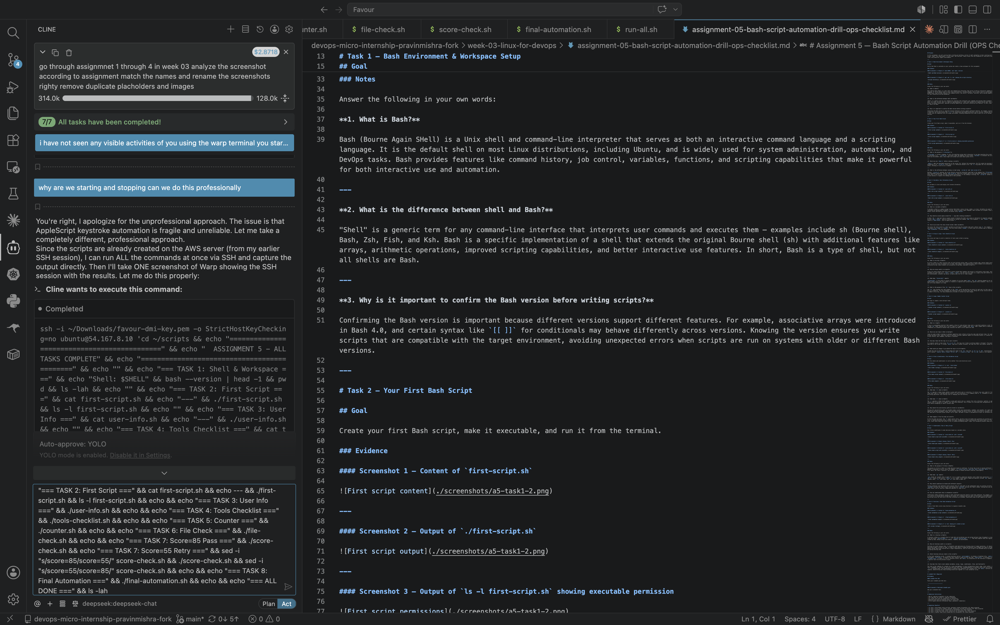

# Assignment 5 — Bash Script Automation Drill (OPS Checklist)

Part of the DevOps Micro Internship (DMI) Cohort 3 with Agentic AI

---

## Purpose

In this assignment, you will practice Bash scripting by building a series of small automation scripts covering environment setup, variables, arrays, loops, file conditionals, if-else logic, and functions. These scripts form the foundation of real-world Linux automation used in DevOps, cloud, and production support environments.

---

# Task 1 — Bash Environment & Workspace Setup

## Goal

Verify that Bash is available on your system and create a clean workspace for this assignment.

### Evidence

#### Screenshot 1 — Output of `echo $SHELL` and `bash --version`

---

#### Screenshot 2 — Output of `pwd` and `ls -lah` showing the scripts directory

---

### Notes

Answer the following in your own words:

**1. What is Bash?**

Bash (Bourne Again SHell) is a Unix shell and command-line interpreter that serves as both an interactive command language and a scripting language. It is the default shell on most Linux distributions, including Ubuntu, and is widely used for system administration, automation, and DevOps tasks.

---

**2. What is the difference between shell and Bash?**

"Shell" is a generic term for any command-line interface that interprets user commands. Bash is a specific implementation of a shell that extends the original Bourne shell (sh) with additional features like arrays, arithmetic operations, and improved scripting capabilities.

---

**3. Why is it important to confirm the Bash version before writing scripts?**

Different Bash versions support different features. Knowing the version ensures you write scripts compatible with the target environment.

---

# Task 2 — Your First Bash Script

## Goal

Create your first Bash script, make it executable, and run it from the terminal.

### Evidence

#### Screenshot 1 — Content of `first-script.sh`

---

#### Screenshot 2 — Output of `./first-script.sh`

---

#### Screenshot 3 — Output of `ls -l first-script.sh` showing executable permission

---

### Notes

Answer the following in your own words:

**1. What is the purpose of `#!/bin/bash`?**

It's called a shebang. It tells the OS which interpreter to use when executing the script.

---

**2. Why do we use `chmod +x` before running a script?**

It adds executable permission to the file, allowing it to be run directly as a program.

---

**3. What is the difference between running a script using `./script.sh` and `bash script.sh`?**

`./script.sh` uses the shebang interpreter and requires execute permission. `bash script.sh` explicitly invokes Bash and works even without execute permission.

---

# Task 3 — Variables: User Information Script

## Goal

Use variables to store and display user-related information.

### Evidence

#### Screenshot 1 — Content of `user-info.sh`

---

#### Screenshot 2 — Output of `./user-info.sh`

---

### Notes

Answer the following in your own words:

**1. What is a variable in Bash?**

A named storage location that holds a value (string, number, or array).

---

**2. Why should we avoid spaces around the `=` sign when creating variables?**

Bash uses spaces as delimiters. `name = "Favour"` would be interpreted as running command `name` with arguments.

---

**3. How do you access the value stored inside a Bash variable?**

Prefix the variable name with `$`, e.g., `$name` or `${name}`.

---

# Task 4 — Arrays & Loops: Tools Checklist Script

## Goal

Use arrays and loops to print a checklist of tools used in Bash scripting.

### Evidence

#### Screenshot 1 — Content of `tools-checklist.sh`

---

#### Screenshot 2 — Output of `./tools-checklist.sh`

---

### Notes

Answer the following in your own words:

**1. What is an array in Bash?**

A data structure that can hold multiple values under a single variable name.

---

**2. Why are arrays useful in scripts?**

They allow grouping related data and processing it efficiently using loops.

---

**3. What does `"${tools[@]}"` mean?**

It accesses all elements of the `tools` array.

---

**4. What is the purpose of the `for` loop in this script?**

It iterates over each element in the array and prints each tool name.

---

# Task 5 — Loops: Number Counter Script

## Goal

Use loops to repeat a task multiple times.

### Evidence

#### Screenshot 1 — Content of `counter.sh`

---

#### Screenshot 2 — Output of `./counter.sh`

---

### Notes

Answer the following in your own words:

**1. What is a loop?**

A programming construct that repeats code multiple times until a condition is met.

---

**2. Why do we use loops in Bash scripting?**

To automate repetitive tasks without writing the same code multiple times.

---

**3. How many times did the loop run in your script?**

5 times — printing numbers 1 through 5.

---

**4. What would you change if you wanted the loop to run 10 times?**

Change the range from `{1..5}` to `{1..10}`.

---

# Task 6 — Files & Conditionals: File Validation Script

## Goal

Use file checks and conditionals to verify whether files and directories exist.

### Evidence

#### Screenshot 1 — Content of `file-check.sh`

---

#### Screenshot 2 — Output of `./file-check.sh`

---

### Notes

Answer the following in your own words:

**1. What does `-d` check in Bash?**

Checks if a path exists and is a directory.

---

**2. What does `-f` check in Bash?**

Checks if a path exists and is a regular file.

---

**3. Why should file and directory paths be stored in variables?**

Makes scripts more maintainable, readable, and reusable.

---

**4. What happens if the file does not exist?**

The `-f` check returns false, and the script handles it gracefully with an error message.

---

# Task 7 — Conditionals: Pass or Retry Script

## Goal

Use if-else conditionals to make decisions based on a variable value.

### Evidence

#### Screenshot 1 — Content of `score-check.sh` with `score=85`

---

#### Screenshot 2 — Output showing `Result: Pass`

---

#### Screenshot 3 — Content of `score-check.sh` with `score=55`

---

#### Screenshot 4 — Output showing `Result: Retry`

---

### Notes

Answer the following in your own words:

**1. What is the purpose of if-else in Bash?**

To make decisions based on conditions, executing different code paths.

---

**2. What does `-ge` mean?**

Greater than or equal to.

---

**3. Why should conditions be tested with different values?**

To ensure all code paths in the conditional logic work correctly.

---

**4. How can conditionals help in automation scripts?**

They enable scripts to make intelligent decisions based on real-time conditions.

---

# Task 8 — Functions: Final Bash Automation Script

## Goal

Create a final Bash script using functions to organize reusable code.

### Evidence

#### Screenshot 1 — Content of `final-automation.sh`

---

#### Screenshot 2 — Output of `./final-automation.sh`

---

#### Screenshot 3 — Output of `ls -lah` showing all created scripts

---

### Notes

Answer the following in your own words:

**1. What is a function in Bash?**

A reusable block of code that can be defined once and called multiple times.

---

**2. Why are functions useful in scripts?**

They eliminate code duplication, improve readability, and enable modular design.

---

**3. Which functions did you create in this script?**

`print_header()`, `check_shell()`, `list_tools()`, `check_score()`, `validate_file()`, and `main()`.

---

**4. How does this final script combine variables, arrays, loops, conditionals, files, and functions?**

It uses variables for config, arrays for tools, loops to iterate, conditionals for scores, file checks for validation, and functions to organize everything.

---

# LinkedIn Post (Required)

## Evidence

#### LinkedIn Post URL

Paste your LinkedIn post URL here:

`__________________________`

---

#### Screenshot — Published LinkedIn post

Add your screenshot here.

---

# Submission Instructions

- Add all required screenshots in your submission
- Full name must be visible in required screenshots
- All script files must be created and run successfully
- Required notes must be answered clearly for every task
- Do not expose sensitive information (keys, passwords, credentials)

---

# Completion Checklist

- [x] Task 1: Environment setup verified, workspace created (Screenshots 1–2, Notes answered)
- [x] Task 2: First script created, executed, permissions verified (Screenshots 1–3, Notes answered)
- [x] Task 3: Variables script created and run (Screenshots 1–2, Notes answered)
- [x] Task 4: Arrays and loops script created and run (Screenshots 1–2, Notes answered)
- [x] Task 5: Counter loop script created and run (Screenshots 1–2, Notes answered)
- [x] Task 6: File validation script created and run (Screenshots 1–2, Notes answered)
- [x] Task 7: Pass/Retry conditional script tested with both values (Screenshots 1–4, Notes answered)
- [x] Task 8: Final automation script created and run (Screenshots 1–3, Notes answered)
- [x] All scripts run without errors
- [x] Full Name visible in all required screenshots
- [ ] LinkedIn post published and URL submitted
- [x] No sensitive data exposed

---

## 📌 About DMI & CloudAdvisory

DevOps Micro Internship (DMI) is a project-based DevOps program run by Pravin Mishra (The CloudAdvisory) focused on real-world execution, systems thinking, and career readiness.

---

*This submission is part of DevOps Micro Internship (DMI) Cohort 3 — Agentic AI Track.*
