# Assignment 6 — Build an AI-Assisted Linux Health Check (AI-Assisted Linux Incident Triage)

Part of the DevOps Micro Internship (DMI) Cohort 3 with Agentic AI

---

## Purpose

In this assignment, you will build a read-only Bash triage script that checks the health of your Ubuntu server and Nginx application, connect it to Claude Code as a reusable `/linux-triage` skill, simulate a controlled Nginx incident, use the skill to gather and analyze evidence, recover the service manually, and verify recovery. The workflow follows the Agentic Loop: Gather → Analyze → Human Act → Verify.

---

# Task 1 — Confirm the Healthy Baseline and Create the Workspace

## Goal

Confirm that Nginx and the React application are healthy before building the automation.

### Evidence

#### Screenshot 1 — Output of `systemctl is-active nginx`, `ss -ltn | grep ':80'`, and `curl -I http://localhost`

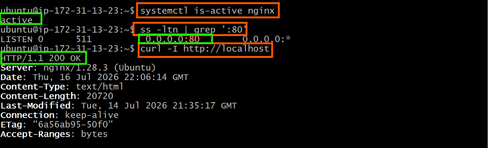

---

#### Screenshot 2 — Output of `pwd` and `find . -maxdepth 4 -type d | sort` showing the workspace folder structure

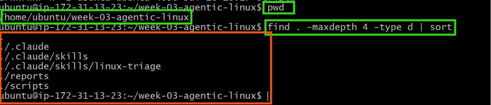

---

### Notes

Answer the following in your own words:

**1. What proves that Nginx is running?**

The command systemctl is-active nginx returned active, which confirms that the Nginx service is currently running on the Ubuntu server.

---

**2. What proves that the server is listening for HTTP traffic?**

The command ss -ltn | grep ':80' showed LISTEN 0 511 0.0.0.0:80, which confirms that the server is listening for incoming HTTP connections on port 80. Additionally, the command curl -I http://localhost returned HTTP/1.1 200 OK, proving that the web server is successfully responding to HTTP requests.

---

**3. Why must you capture a healthy baseline before simulating an incident?**

A healthy baseline verifies that the server and application are working correctly before any changes are made. It provides a reference point that allows the results after the simulated incident to be compared with the normal state. This helps confirm that any failures observed are caused by the simulated incident rather than an existing problem with the server or application.

---

# Task 2 — Create Project Context and Safety Rules in CLAUDE.md

## Goal

Tell Claude exactly what this project does and what it is not allowed to do.

### Evidence

#### Screenshot 3 — CLAUDE.md open in VS Code showing all four sections (Project Overview, Incident Workflow, Safety Rules, Output Rules)

---

### Notes

Answer the following in your own words:

**1. Why should Claude receive project-specific operational rules?**

Project-specific operational rules ensure that Claude understands the project's objectives, follows the correct incident workflow, and operates within defined safety boundaries. This helps produce consistent, reliable recommendations while preventing unsafe or unintended actions.

---

**2. Why is the human required to execute the recovery command?**

The human is responsible for reviewing the evidence and approving any recovery action before it is executed. This prevents accidental changes, maintains operational control, and reduces the risk of making incorrect decisions during an incident.

---

**3. Which rule prevents Claude from making an unsupported diagnosis?**

The rule "Do not claim a root cause unless the report contains supporting evidence." prevents Claude from making assumptions or unsupported diagnoses. It ensures that every conclusion is based only on the evidence collected by the Bash script.

---

# Task 3 — Use Agentic AI to Plan Before Writing the Script

## Goal

Use Claude Code to inspect the environment and produce a read-only plan before creating any Bash code.

### Evidence

#### Screenshot 4 — Claude Code showing the five-check plan and read-only inspection results
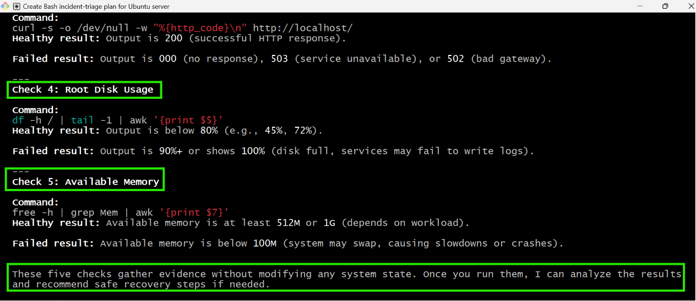

---

### Notes

Answer the following in your own words:

**1. Which part of this task represents the Gather phase?**

The Gather phase is when Claude uses read-only Linux commands to inspect the Ubuntu server and collect information about the Nginx service, port 80, the HTTP response, disk usage, and available memory before making any recommendations.

---

**2. Did Claude follow the instruction not to create files? How did you verify this?**

Yes. Claude only inspected the system and provided a health-check plan without creating or modifying any files. I verified this by checking the project directory afterwards and confirming that only the existing files were present.

---

**3. Why is planning before coding useful in DevOps automation?**

Planning helps define what the script should check, the commands it should use, and the expected results before writing any code. This reduces errors, improves consistency, and makes the automation easier to develop and maintain.

---

# Task 4 — Build the Linux Triage Bash Script

## Goal

Create one Bash script that gathers consistent Linux and Nginx health evidence.

### Evidence

#### Screenshot 5 — Top section of `linux-triage.sh` showing variables, thresholds, and the checks array

---

#### Screenshot 6 — Middle section showing check functions and conditionals

Add your screenshot here.

---

#### Screenshot 7 — Bottom section showing the loop, summary function, and exit behavior

Add your screenshot here.

---

#### Screenshot 8 — Output of `bash -n scripts/linux-triage.sh` (no syntax errors) and `ls -l scripts/linux-triage.sh` showing executable permission

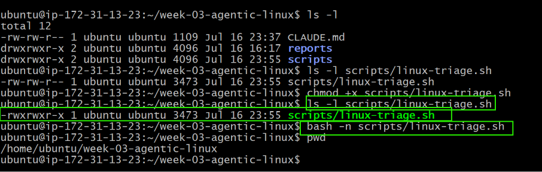
---

### Notes

Answer the following in your own words:

**1. What is stored in the checks array?**

The checks array stores the names of the five health-check functions: check_service, check_port, check_http, check_disk, and check_memory. Each function performs a specific system health check.

---

**2. How does the `for` loop use that array?**

The for loop reads each function name from the checks array and executes it one by one. This ensures that every health check runs in a consistent order without repeating code.

---

**3. Why are the health checks separated into functions?**

Each function performs a single task, making the script easier to read, maintain, and troubleshoot. If one check needs to be updated, it can be modified without affecting the others.

---

**4. What is the purpose of `$(...)` in this script?**

The $(...) syntax executes a command and stores its output. In this script, it is used to capture values such as the current date, hostname, HTTP status code, disk usage, available memory, and recent Nginx logs.

---

**5. Why does the script use different exit codes for HEALTHY, WARN, and FAIL?**

Different exit codes indicate the overall health of the system. Exit code 0 means all checks passed, 1 indicates one or more warnings, and 2 means at least one critical check failed. This allows users and automation tools to identify the server's status quickly.

---

# Task 5 — Run and Understand the Healthy-State Report

## Goal

Run the Bash script against the healthy server and verify that it creates a report.

### Evidence

#### Screenshot 9 — Output of `./scripts/linux-triage.sh` showing your Full Name and all five check results

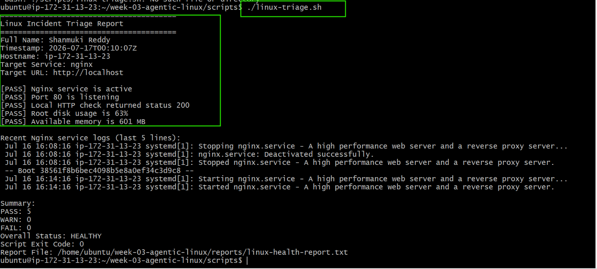

---

#### Screenshot 10 — Output showing the captured exit code and final summary
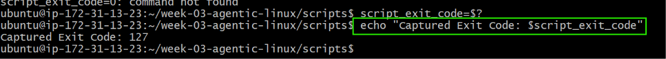
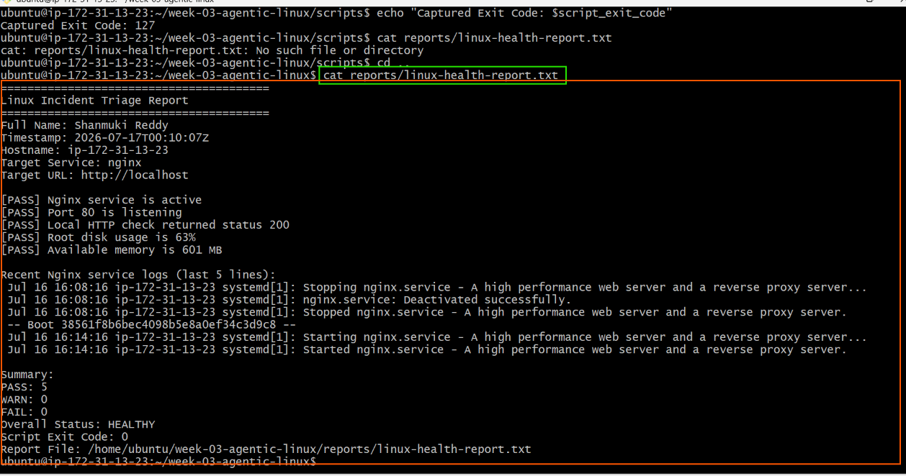

---

### Notes

Answer the following in your own words:

**1. What is the overall status of your healthy baseline?**

The overall status of my healthy baseline was HEALTHY because all critical health checks passed successfully before the incident simulation.

---

**2. Which exact Linux evidence proves the application is serving traffic?**

The report showed Port 80 is listening and the local HTTP check returned HTTP status 200. This confirms that Nginx is accepting connections and serving the application successfully.

---

**3. Did your script return exit code 0 or 1? Explain why.**

My script returned exit code 0 because all health checks passed without any warnings or failures.

---

**4. What is the difference between a warning and a failure in this script?**

A warning indicates that the server is still operational but requires attention, such as high disk usage or low available memory. A failure indicates that a critical service or check has failed, such as Nginx being inactive, port 80 not listening, or the HTTP request failing.

---

# Task 6 — Create and Run the /linux-triage Skill

## Goal

Turn the Bash script into a reusable, manually invoked Agentic AI workflow.

### Evidence

#### Screenshot 11 — `SKILL.md` showing the frontmatter, allowed tool restrictions, and safety rules

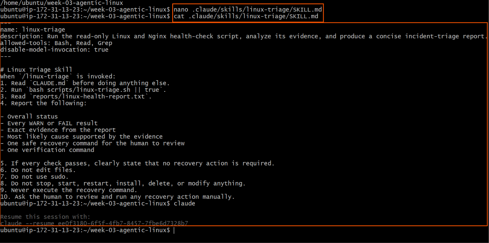

---

#### Screenshot 12 — `/linux-triage` output for the healthy server

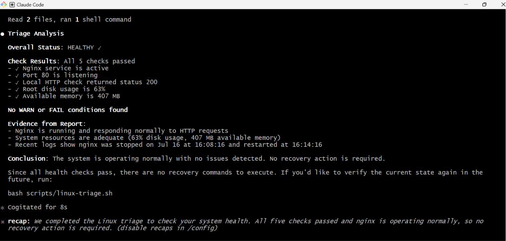

---

### Notes

Answer the following in your own words:

**1. Why does this skill have Bash, Read, and Grep, but not Write?**

The skill requires Bash to execute the health-check script, Read to access the generated report, and Grep to search for important information in the report. It does not need Write because it should not modify project files or the server.

---

**2. Why is `disable-model-invocation: true` useful for this skill?**

This setting ensures that the skill only runs when I explicitly invoke it. It prevents the AI from automatically executing the workflow without my approval.

---

**3. What part is performed by Bash, and what part is performed by Claude?**

The Bash script collects system information by checking the service status, port availability, HTTP response, disk usage, memory, and logs. Claude reads the generated report, analyses the evidence, explains the findings, and recommends a safe recovery action without executing it.

---

**4. Why is this better than asking Claude "Is my server healthy?" without giving it evidence?**

The skill provides Claude with real-time system evidence collected from the server. This allows Claude to base its analysis on actual data instead of making assumptions or giving a generic response.

---

# Task 7 — Simulate an Nginx Incident and Let the Skill Diagnose It

## Goal

Create a controlled service failure, gather evidence through Bash, and let Claude analyze the evidence without taking recovery action.

### Evidence

#### Screenshot 13 — Output showing Nginx is inactive and the HTTP request fails

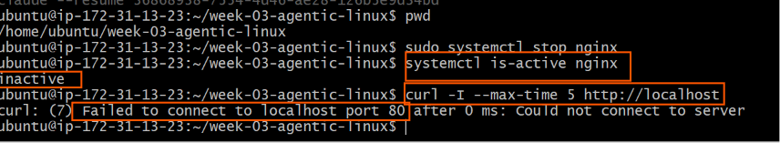
---

#### Screenshot 14 — `/linux-triage` output showing failed evidence, most likely cause, and a suggested recovery command

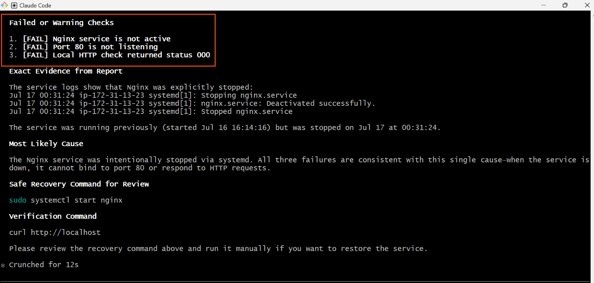

---

#### Screenshot 15 — `incident-failure-report.txt` showing the failed checks and your Full Name

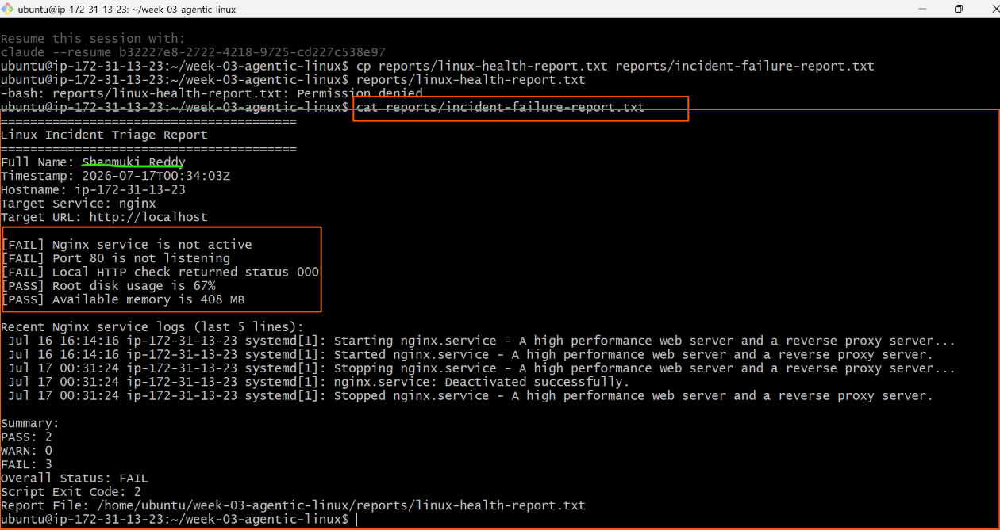

---

### Notes

Answer the following in your own words:

**1. Which three checks failed?**

The failed checks were the Nginx service status, the port 80 listening check, and the local HTTP response check.

---

**2. What evidence supports the conclusion that Nginx is unavailable?**

The report showed that the Nginx service was inactive, port 80 was not listening, and the local HTTP request returned status code 000. These results confirm that Nginx was unavailable.

---

**3. Did Claude execute the recovery command? Why is that important?**

No. Claude only recommended the recovery command and did not execute it. This is important because any operational change should be reviewed and approved by a human before being performed.

---

**4. Which phase of the Agentic Loop is represented by the Bash report?**

The Bash report represents the Gather phase because it collects system evidence using Linux commands.

---

**5. Which phase is represented by Claude's explanation?**

Claude's explanation represents the Analyse phase because it interprets the collected evidence, identifies the likely cause, and recommends a safe recovery action

---

# Task 8 — Recover Manually, Verify Again, and Write the Incident Summary

## Goal

Recover the service as the human operator and prove that the system is healthy again.

### Evidence

#### Screenshot 16 — Output showing Nginx is active and `curl -I http://localhost` returns 200 OK

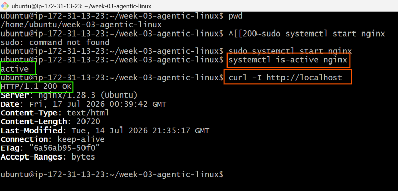

---

#### Screenshot 17 — Second `/linux-triage` output showing successful recovery with no FAIL results

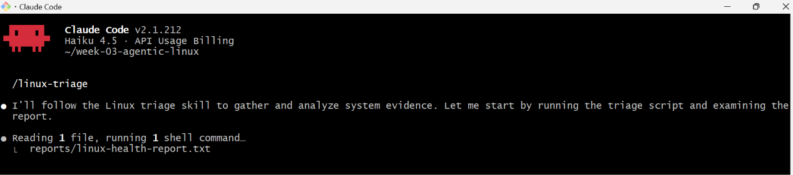

---

#### Screenshot 18 — Output of `ls -lah reports` showing both `incident-failure-report.txt` and `recovery-report.txt`

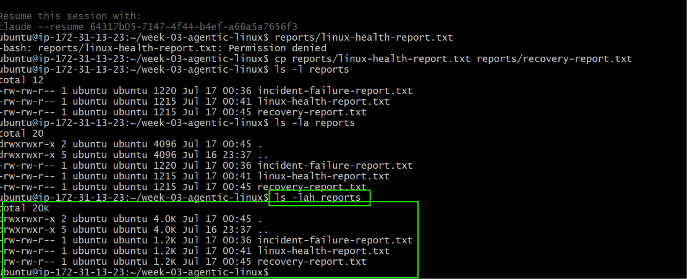
---

#### Screenshot 19 — `incident-summary.md` showing all required sections and your Full Name

Add your screenshot here.

---

### Notes

Answer the following in your own words:

**1. What action did you execute manually?**

After reviewing the evidence and Claude's recommendation, I manually executed sudo systemctl start nginx to restore the Nginx service.

---

**2. What evidence proves that the service recovered?**

The command systemctl is-active nginx returned active, curl -I http://localhost returned HTTP/1.1 200 OK, and the second /linux-triage report contained no failed checks.

---

**3. Why is the second triage run necessary?**

The second triage run confirms that the recovery was successful by verifying the service status, HTTP response, disk usage, memory, and other health checks after the repair.

---

**4. What could go wrong if an AI agent automatically restarted every failed service?**

Automatically restarting services without understanding the root cause could hide underlying problems, trigger repeated failures, interrupt running applications, or make an incident more difficult to diagnose.

---

**5. In one sentence, explain the difference between using AI as a chatbot and using AI in this agentic workflow.**

A chatbot mainly answers questions, whereas this agentic workflow uses AI to analyse real system evidence and assist with decision-making while leaving all recovery actions under human control.

---

# Incident Summary

Fill in all seven sections below in your own words.

**Full Name:** Shanmuki Reddy

**Date:** 17/07/2026

---

**1. Reported Symptom**

# Incident Summary

Fill in all seven sections below in your own words.

**Full Name:** Shanmuki Reddy

**Date:** 17/07/2026

---

**1. Reported Symptom**

The website hosted on the Ubuntu server could not be accessed after the Nginx service was stopped during the incident simulation. The application was unavailable and failed to respond to HTTP requests.

---

**2. Evidence Collected**

The Bash triage report showed that the Nginx service was inactive, port 80 was not listening, and the local HTTP check returned status code 000 instead of 200 OK. These failed checks indicated that the web server was not serving the application.

---

**3. Most Likely Cause**

Based on the collected evidence, the most likely cause was that the Nginx service had been stopped. Since the service was inactive, the server was not listening on port 80 and could not respond to HTTP requests.

---

**4. Human-Approved Recovery Action**

After reviewing the report and Claude's recommendation, I manually restarted the Nginx service by running:

sudo systemctl start nginx

The recovery action was performed manually rather than by the AI.
---

**5. Verification**

After restarting Nginx, I verified the recovery by checking that systemctl is-active nginx returned active and curl -I http://localhost returned HTTP/1.1 200 OK. I then ran the /linux-triage skill again, and the report showed no failed health checks.

---

**6. Safety Decision**

The AI skill was only allowed to gather evidence, analyse the report, and recommend a recovery command. It was not permitted to restart services or make changes to the server. This ensured that all operational changes remained under human approval and reduced the risk of unintended actions.

---

**7. Agentic Loop Mapping**

This incident followed the complete Agentic Loop:

Gather: The Bash script collected system information, including the Nginx status, port 80 status, HTTP response, disk usage, memory usage, and recent logs.
Analyse: Claude reviewed the generated report, explained the failed checks, and identified the most likely cause.
Human Act: I reviewed the recommendation and manually restarted the Nginx service.
Verify: I reran the health checks to confirm that Nginx was active, the application responded with HTTP 200 OK, and the system had returned to a healthy state.

---

# LinkedIn Post (Required)

## Evidence

#### LinkedIn Post URL

Paste your LinkedIn post URL here:

`__________________________`

---

#### Screenshot — Published LinkedIn post

Add your screenshot here.

---

# GitHub Repository URL

Paste the URL of your GitHub folder or repository containing the assignment files here:

`__________________________`

---

# Submission Instructions

- Add all required screenshots in your submission
- Full Name must be visible in required screenshots and the Bash report
- All written answers must be in your own words
- Do not expose sensitive information (keys, passwords, AWS account IDs, tokens)
- GitHub URL must be included in this document

---

# Completion Checklist

- [ ] Task 1: Healthy baseline confirmed, workspace created (Screenshots 1–2, Notes answered)
- [ ] Task 2: CLAUDE.md created with all four sections (Screenshot 3, Notes answered)
- [ ] Task 3: Five-check plan produced by Claude using read-only tools (Screenshot 4, Notes answered)
- [ ] Task 4: `linux-triage.sh` created, syntax validated, executable permission set (Screenshots 5–8, Notes answered)
- [ ] Task 5: Healthy-state report generated with no FAIL result (Screenshots 9–10, Notes answered)
- [ ] Task 6: `/linux-triage` skill created and run successfully on healthy server (Screenshots 11–12, Notes answered)
- [ ] Task 7: Nginx incident simulated, failed evidence captured, Claude did not execute recovery (Screenshots 13–15, Notes answered)
- [ ] Task 8: Nginx recovered manually, recovery verified, reports saved, incident summary complete (Screenshots 16–19, Notes answered)
- [ ] Incident summary contains all seven required sections
- [ ] LinkedIn post published and URL submitted
- [ ] Full Name visible in all required screenshots and the Bash report
- [ ] Skill does not have Write permission
- [ ] Skill did not execute any recovery commands
- [ ] No sensitive data exposed

---

## 📌 About DMI & CloudAdvisory

DevOps Micro Internship (DMI) is a project-based DevOps program run by Pravin Mishra (The CloudAdvisory) focused on real-world execution, systems thinking, and career readiness.

It helps learners build strong DevOps foundations with hands-on experience.

---

## 📌 Resources

- 🌐 DMI Official Website: https://pravinmishra.com/dmi  
- 🎓 DevOps for Beginners (Udemy): https://www.udemy.com/course/devops-for-beginners-docker-k8s-cloud-cicd-4-projects/  
- 🎓 Agentic AI DevOps with Claude Code: https://www.udemy.com/course/ultimate-agentic-ai-devops-with-claude-code/  
- 🎓 DevOps with Claude Code: Terraform, EKS, ArgoCD & Helm: https://www.udemy.com/course/devops-with-claude-code-terraform-eks-argocd-helm/  
- ▶️ YouTube Playlist: https://www.youtube.com/playlist?list=PLFeSNDtI4Cho  
- 🔗 Pravin Mishra (LinkedIn): https://www.linkedin.com/in/pravin-mishra-aws-trainer/  
- 🏢 CloudAdvisory (LinkedIn): https://www.linkedin.com/company/thecloudadvisory/

---

*This submission is part of DevOps Micro Internship (DMI) Cohort 3 — Agentic AI Track.*