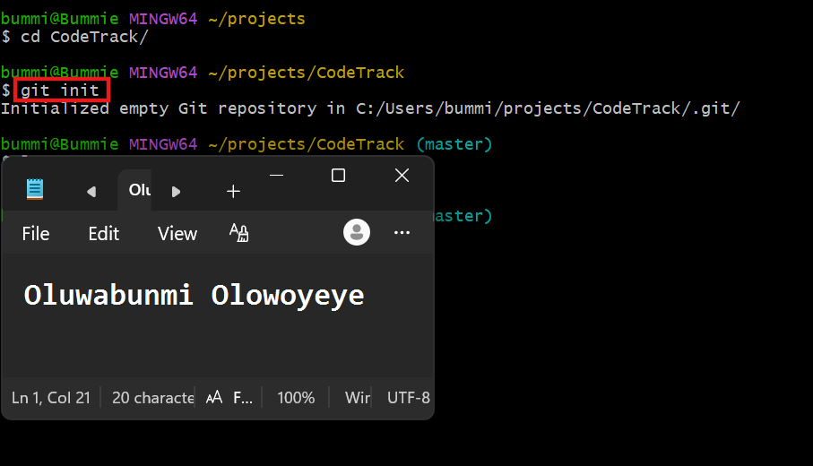
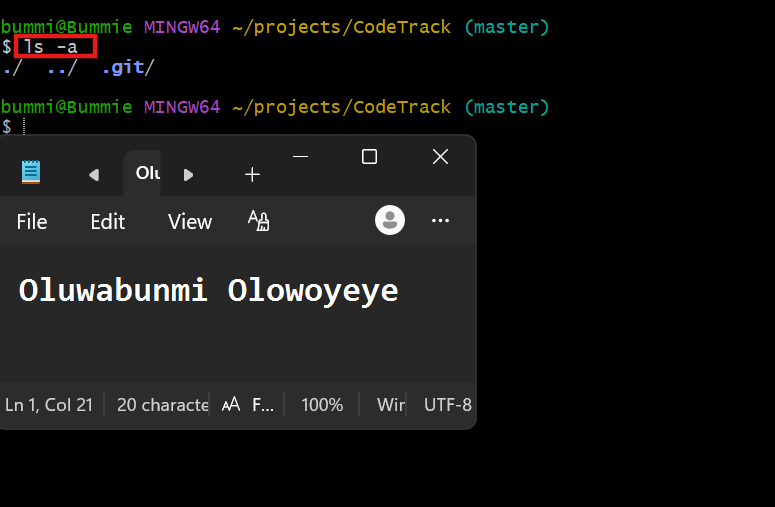
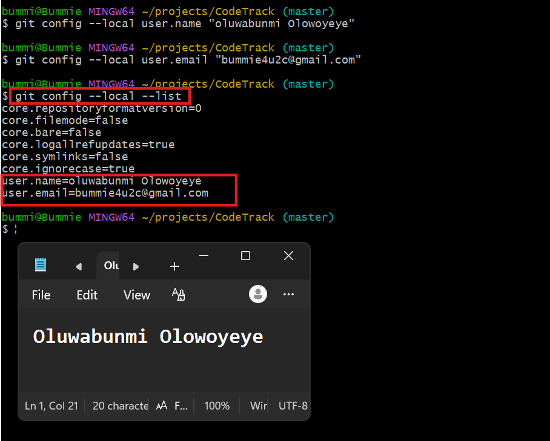
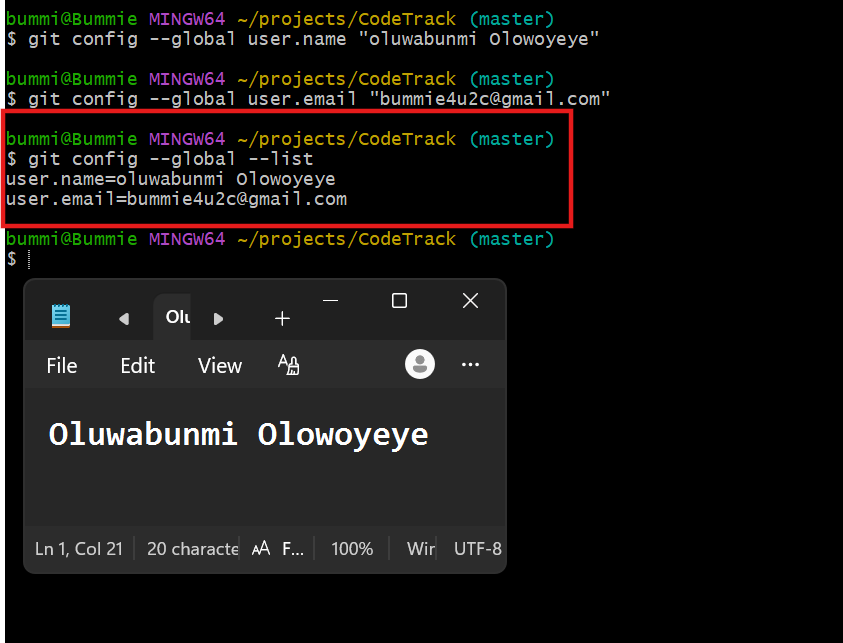

# Assignment 1 — CodeTrack: Initial Git Setup (Local Only)

Part of the DevOps Micro Internship (DMI) Cohort 3 with Agentic AI

---

## Purpose

In this assignment, you will set up Git correctly on your local machine before starting the CodeTrack project. You will create a local repository and configure your Git identity at both the repository level (local) and the machine level (global). This assignment is local only — you will not push anything to GitHub yet.

---

# Task 1 — Create the CodeTrack Project and Initialize Git

## Goal

Create a `CodeTrack` project folder and initialize it as a Git repository.

### Evidence

#### Screenshot 1 — Output of `git init` inside `CodeTrack` showing "Initialized empty Git repository"

---

#### Screenshot 2 — Output of `ls -a` showing the `.git` folder

---

### Notes

**1. What is the `.git` folder, and why does it matter?**

The .git folder is a hidden directory that Git creates when you initialize a repository with git init or clone an existing repository. It contains all of the repository's version control data and metadata.

It matters because it stores everything Git needs to track your project's history, including:

Commit history – Records every commit made to the repository.
Branches and tags – Keeps track of different development branches and release tags.
Configuration – Stores repository-specific Git settings.
Staging area (index) – Holds changes that have been staged before committing.
References (refs) – Points to branches, tags, and commits.
Objects – Stores the actual content of files, commits, trees, and blobs.

Without the .git folder, a project is just a regular directory of files. Git would no longer know the project's history, branches, or tracked changes, and version control features such as commits, branching, merging, and reverting would no longer work.

---

# Task 2 — Configure Git Identity Locally (Repository-Only)

## Goal

Set your Git username and email for the `CodeTrack` repository only, using `git config --local`.

### Evidence

#### Screenshot 3 — Output of `git config --local --list` showing your `user.name` and `user.email`

---

# Task 3 — Configure Git Identity Globally

## Goal

Set a global Git username and email for this machine using `git config --global`. Note that CodeTrack's local settings still take priority over these.

### Evidence

#### Screenshot 4 — Output of `git config --global --list` showing your `user.name` and `user.email`

---

# Submission Instructions

- Add all required screenshots in your submission
- Full Name must be visible in required screenshots
- Do not expose passwords, access tokens, or private keys

---

# Completion Checklist

- [ ] `CodeTrack` folder created and initialized as a Git repository (Screenshots 1–2)
- [ ] Explanation of the `.git` folder written in your own words
- [ ] Local `user.name` and `user.email` configured and verified (Screenshot 3)
- [ ] Global `user.name` and `user.email` configured and verified (Screenshot 4)
- [ ] No sensitive data exposed

---

## 📌 About DMI & CloudAdvisory

DevOps Micro Internship (DMI) is a project-based DevOps program run by Pravin Mishra (The CloudAdvisory) focused on real-world execution, systems thinking, and career readiness.

It helps learners build strong DevOps foundations with hands-on experience.

---

## 📌 Resources

- 🌐 DMI Official Website: https://pravinmishra.com/dmi  
- 🎓 DevOps for Beginners (Udemy): https://www.udemy.com/course/devops-for-beginners-docker-k8s-cloud-cicd-4-projects/  
- 🎓 Agentic AI DevOps with Claude Code: https://www.udemy.com/course/ultimate-agentic-ai-devops-with-claude-code/  
- 🎓 DevOps with Claude Code: Terraform, EKS, ArgoCD & Helm: https://www.udemy.com/course/devops-with-claude-code-terraform-eks-argocd-helm/  
- ▶️ YouTube Playlist: https://www.youtube.com/playlist?list=PLFeSNDtI4Cho  
- 🔗 Pravin Mishra (LinkedIn): https://www.linkedin.com/in/pravin-mishra-aws-trainer/  
- 🏢 CloudAdvisory (LinkedIn): https://www.linkedin.com/company/thecloudadvisory/

---

*This submission is part of DevOps Micro Internship (DMI) Cohort 3 — Agentic AI Track.*
