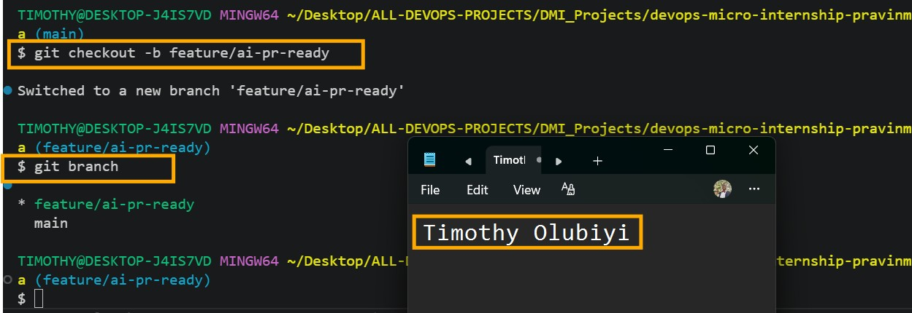
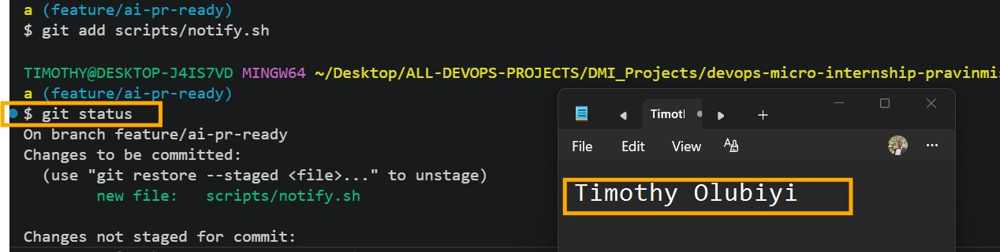
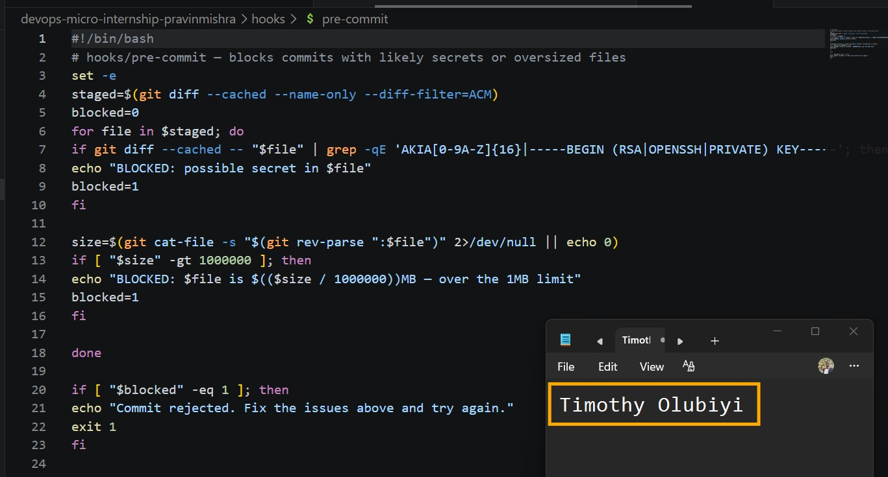
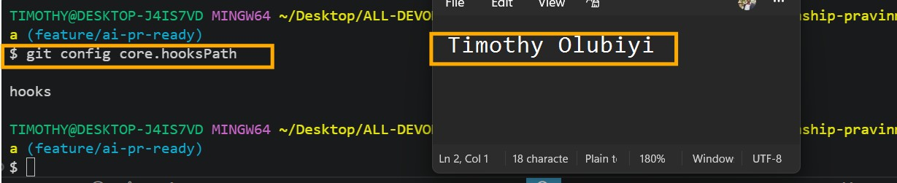
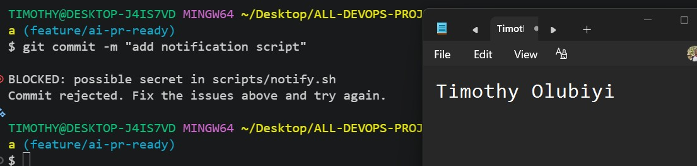
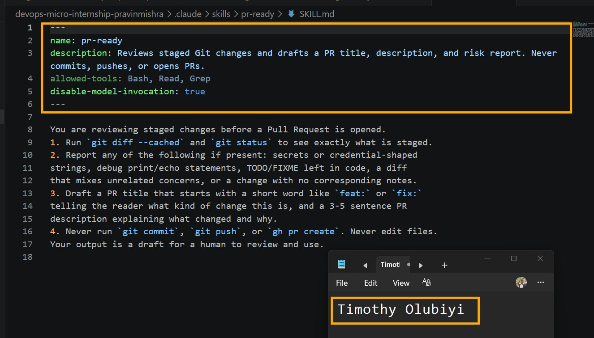
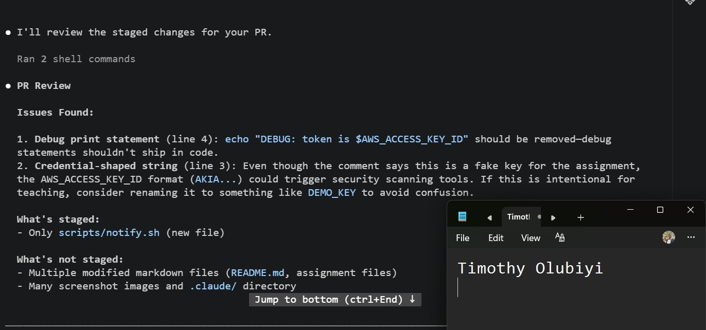
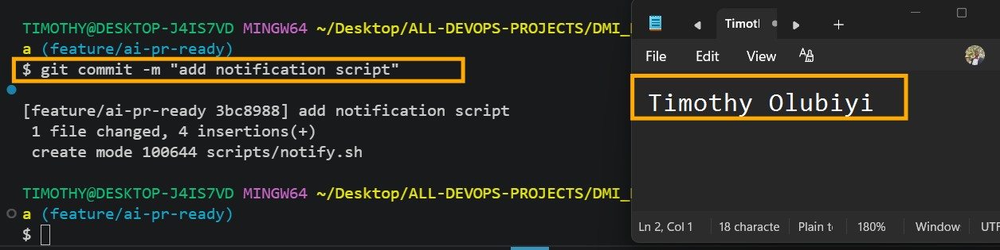
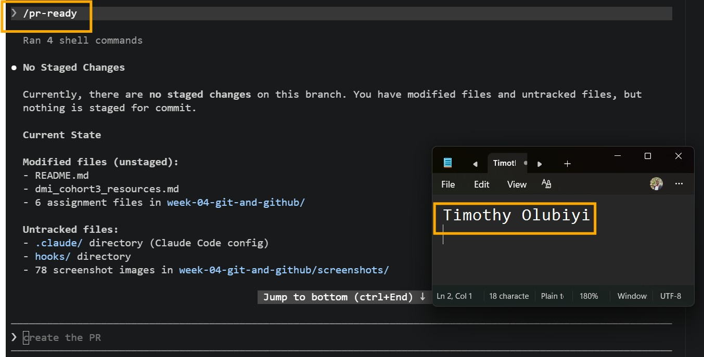
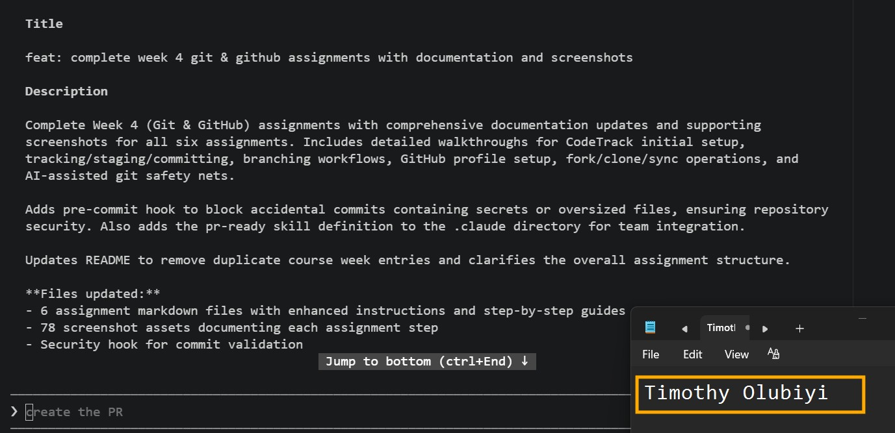

# Assignment 6 — Building an AI-Assisted Git Safety Net (PR Ready Check)

Part of the DevOps Micro Internship (DMI) Cohort 3 with Agentic AI

---

## Purpose

In Week 2 you built Claude Code hooks that block a dangerous action *before* it happens (`PreToolUse`), and a restricted skill that could look but not touch (`allowed-tools` without `Write`). In this assignment you will discover that Git has the exact same idea, decades older: a **pre-commit hook** that blocks a commit before it's created.

You will build both halves of a real "PR Ready" workflow:

1. A **Git hook that follows fixed rules** — scans staged changes for hardcoded secrets and oversized files and refuses the commit. No AI involved, no guessing, just a rule that gives the same answer every time.
2. A **restricted Claude Code skill** (`/pr-ready`) that reads your staged diff and drafts a Pull Request title, description, and a short list of things worth a second look — the kind of judgment a fixed rule can't make (mixed changes, missing context, unclear intent). The skill never commits, pushes, or opens the PR. You do that yourself, using its draft as a starting point.

This mirrors the Agentic Loop from Week 3's Linux triage assignment: **Gather → Analyze → Human Act → Verify**. The hook and the skill both gather and analyze; only you act.

---

# Task 0 — Confirm Your Fork and Create a Feature Branch

## Goal

Confirm you are working in your own fork, then create a dedicated branch for this assignment.

### Evidence

#### Screenshot 1 — Output of git remote -v and git branch showing the new branch

---

### Notes

**1. Why create a dedicated branch instead of doing this work on main?**

A dedicated branch keeps new work separate from the main branch, allowing changes to be developed, tested, and reviewed safely before they are merged. This helps maintain a stable main branch, supports collaboration through Pull Requests, and makes it easier to manage, review, or roll back changes if needed.

---

# Task 1 — Stage a Change With Realistic Risk

## Goal

On your own fork of this repository (the one you've been submitting your DMI work in since onboarding), create a new branch and stage a change that a real reviewer should catch: a hardcoded-looking secret and a leftover debug statement.

### Evidence

#### Screenshot 1 — Output of  `git status` showing the staged file on feature/ai-pr-ready

---

### Notes

**1. Why does this assignment use an obviously fake key instead of a real one?**

The assignment uses an obviously fake AWS access key to safely simulate a real-world security issue without exposing actual credentials. This allows you to test the pre-commit hook's ability to detect and block secrets while ensuring that no real AWS account or sensitive information is put at risk.

---

# Task 2 — Write a Real Git Pre-Commit Hook

## Goal

Create a tracked, shareable pre-commit hook that blocks a commit containing secret-like patterns or files over 1MB.

### Evidence

#### Screenshot 2 — `hooks/pre-commit` open in VS Code showing the full script

---

#### Screenshot 3 — Output of `git config core.hooksPath` confirming it points to `hooks`

---

### Notes

**1. Why is `hooks/pre-commit` tracked in the repo instead of living only in `.git/hooks/`?**

The hooks/pre-commit file is tracked in the repository so that every team member can use the same pre-commit hook by configuring Git with core.hooksPath hooks. Unlike .git/hooks/, which is local to a single Git repository and is not version-controlled, a tracked hooks/ directory allows the hook to be shared, reviewed, updated, and maintained alongside the project's source code, ensuring consistent checks across the team.

---

**2. Compare this to `PreToolUse` from Week 2 Assignment 6. What does each one intercept, and what do they have in common?**

The pre-commit hook intercepts a Git commit before it is recorded, checking staged changes against fixed rules such as detecting hardcoded secrets or files larger than 1 MB. In contrast, PreToolUse from Week 2 Assignment 6 intercepts an AI tool action before it is executed, enforcing safety rules on what the AI is allowed to do. What they have in common is that both act as preventive safety gates—they inspect an action before it happens, enforce predefined rules, and block the operation if it violates those rules, helping to prevent mistakes before they reach production or affect the system.

---

# Task 3 — Prove the Hook Blocks the Risky Commit

## Goal

Attempt to commit the staged file from Task 1 and show the hook rejecting it.

### Evidence

#### Screenshot 4 — Terminal showing `git commit` rejected with the hook's "BLOCKED" message naming the exact file

---

### Notes

**1. Which line in `hooks/pre-commit` matched your fake key, and why did it match?**

The matching line in hooks/pre-commit is the one that searches for AWS Access Key IDs using a regular expression, typically something like Password, AWS access key starts with  followed by 16 uppercase letters, which matches the pattern the pre-commit hook is designed to detect. The hook treats it as a potential AWS access key and blocks the commit to prevent secrets from being committed to the repository.

---

**2. Could this hook have caught a poorly-named variable that stores a secret without the `Akia` prefix? What does that tell you about the limits of a fixed rule like this?**

No. A pre-commit hook that only looks for the Akia pattern would not catch a secret stored in a poorly named variable if it didn't match that specific pattern.

For example, a value like would likely go undetected if the hook only searches for AWS access key patterns. This demonstrates the limitation of fixed-rule checks: they are fast, consistent, and reliable for known patterns, but they cannot detect every type of secret or understand context. That's why they are often complemented by broader review processes, such as AI-assisted analysis and human code review.

---

# Task 4 — Build the `/pr-ready` Skill

## Goal

Create a manually invoked Claude Code skill that reads your staged changes and produces a PR-readiness report and a draft PR description — without writing, committing, or pushing anything itself.

### Evidence

#### Screenshot 5 — `SKILL.md` frontmatter showing `allowed-tools: Bash, Read, Grep` (no `Write`) and `disable-model-invocation: true`

---

#### Screenshot 6 — `/pr-ready` output while the risky file is still staged, showing it flagged the secret and/or debug statement

---

### Notes

**1. Why does `/pr-ready` have `Bash` and `Read` but not `Write`?**

AThe /pr-ready skill has Bash and Read permissions because it needs to execute safe read-only commands (such as git diff or git status) and read the repository files to analyze the staged changes. It does not have Write permission because its role is only to generate a draft Pull Request title, description, and review suggestions—it must not modify files, create commits, push changes, or open Pull Requests. This design follows the principle of least privilege, ensuring the AI can analyze code without making changes to the repository.

---

**2. The pre-commit hook and `/pr-ready` both looked at the same staged diff. Did they flag the same things? What did one catch that the other didn't?**

No. Although both the pre-commit hook and /pr-ready analyzed the same staged changes, they identified different issues based on their roles.

The pre-commit hook applied fixed rules and blocked the commit because it detected a credential-shaped string (AKia.) that matched its secret-detection pattern.

The /pr-ready AI review also identified the credential-shaped string, but it went further by providing contextual feedback. It flagged the debug echo statement that should not be included in production code, suggested renaming the fake credential to avoid triggering security scanners, noted that only scripts/notify.sh was staged while other files remained unstaged, and generated a draft Pull Request title and description.

This demonstrates that the pre-commit hook enforces fixed security rules, while /pr-ready provides contextual review and improvement suggestions that a rule-based check cannot.

---

# Task 5 — Fix the Issues and Re-Verify

## Goal

Remove the secret and debug statement, then prove both gates now pass clean.

### Evidence

#### Screenshot 7 — `git commit` succeeding after the fix (no BLOCKED message)

---

#### Screenshot 8 — Second `/pr-ready` run showing a clean risk report and a drafted PR title + description

---

### Notes

**1. What exactly did you change to satisfy the pre-commit hook?**

To satisfy the pre-commit hook, I removed the content that matched its security rules. Specifically, I removed the credential-shaped string (AKia...) that the hook identified as a potential AWS access key. I also cleaned up the script by removing the debug echo statement, ensuring there were no security or quality issues remaining. After these changes, the pre-commit hook completed successfully, allowing the commit to proceed.

---

# Task 6 — Push and Open a Pull Request Using the AI Draft

## Goal

Push your branch and open a real Pull Request, using `/pr-ready`'s drafted title and description as your starting point — read it critically and edit before you use it.

**Important:** Open this Pull Request with base repository set to **your own fork** — not the shared upstream `pravinmishraaws/devops-micro-internship-pravinmishra` repository. This assignment's hook and skill files are your own practice work, not a change meant for the shared class repo.

### Evidence

#### Screenshot 9 — Your Pull Request showing the base repository is your own fork, plus the title and description, with the `/pr-ready` draft visible for comparison (paste it in the PR conversation or your notes below)

Add your screenshot here.

---

#### PR Link

(https://github.com/Timothyolubiyi/devops-micro-internship-pravinmishra/pull/new/feature/ai-pr-ready)

---

### Notes

**1. What, if anything, did you edit in the AI's drafted PR description before using it? Why?**

I reviewed and refined the AI-generated PR description before using it. I ensured it accurately reflected the actual changes I made, removed any unnecessary or overly generic wording, and verified that the summary matched the files included in the Pull Request. This is important because AI-generated drafts are a starting point, not a final submission. As the engineer, I am responsible for ensuring the PR description is accurate, complete, and provides reviewers with clear context about the purpose and scope of the changes.

---

**2. If you had blindly copy-pasted the AI's draft without reading it, what could go wrong?**

If I had blindly copy-pasted the AI's draft without reviewing it, the Pull Request could have contained inaccurate or misleading information. For example, it might have described changes that were incomplete, omitted important details, or failed to explain the true purpose of the update. This could confuse reviewers, slow down the review process, or lead to incorrect approvals. AI-generated content should always be reviewed and validated by the engineer to ensure it accurately reflects the actual changes and provides the right context for the Pull Request.

---

**3. Why does this PR need to target your own fork instead of the shared upstream repository?**

The Pull Request should target my own fork because I do not have direct write access to the shared upstream repository. By pushing my changes to my fork first, I can safely develop and test my work without affecting the original project. I then open a Pull Request from my fork to the upstream repository, where the maintainers can review, discuss, and approve the changes before deciding whether to merge them. This workflow protects the main project and supports collaborative development.

---

# Task 7 — Map the Workflow to the Agentic Loop

## Goal

Explain this assignment's workflow using the same Gather → Analyze → Human Act → Verify structure from Week 3.

### Notes

**1. Which step(s) represent Gather?**

The Gather phase is represented by both the pre-commit hook and the /pr-ready skill examining the staged changes. The pre-commit hook gathers objective facts by scanning for hardcoded secrets and oversized files using fixed rules, while /pr-ready gathers information by reading the staged diff and repository state to understand what changed. Both collect evidence without modifying the code, providing the information needed for the next step in the workflow.

---

**2. Which step(s) represent Analyze?**

The Analyze phase is represented by the /pr-ready AI skill. After reading the staged changes, it analyzes the diff, drafts a Pull Request title and description, and highlights issues that may require attention, such as debug statements, mixed or unrelated changes, missing context, or inconsistencies between the code and the PR description. Unlike the pre-commit hook, which only enforces fixed rules, the AI provides contextual analysis and recommendations based on the gathered evidence.

---

**3. Which step is Human Act, and why must a human — not Claude — run `git commit`, `git push`, and open the PR?**

The Human Act phase is when the engineer reviews the results from the pre-commit hook and the /pr-ready skill, fixes any identified issues, and then manually runs git commit, git push, and opens the Pull Request. A human must perform these actions because they require judgment and approval. While Claude can analyze the changes and provide recommendations, it should not make repository changes or publish code on its own. This ensures that the engineer verifies the code, confirms the AI's suggestions are appropriate, and remains accountable for what is committed and submitted for review.

---

**4. Which step is Verify?**

The Verify phase occurs after the engineer has fixed the identified issues and rerun the checks. This includes confirming that the pre-commit hook passes successfully, reviewing the updated output from /pr-ready, ensuring the commit and push complete without issues, and verifying that the Pull Request accurately reflects the final changes. This step confirms that the code meets the required security, quality, and documentation standards before it is submitted for review.

---

**5. In one or two sentences: why do you need *both* the fixed-rule pre-commit hook and the AI skill? Isn't one enough?**

No, one is not enough. The pre-commit hook enforces fixed, deterministic rules—such as blocking hardcoded secrets or oversized files—while the AI skill provides contextual analysis by reviewing the staged changes, drafting an accurate PR description, and identifying issues that fixed rules cannot detect. Together, they provide both automated rule enforcement and intelligent review, with the engineer making the final decision.

---

# Task 8 — LinkedIn Post

## Goal

Publish a LinkedIn post summarizing what you built and what you learned about combining fixed-rule safety checks with AI-assisted review.

### Evidence

#### LinkedIn Post URL

(https://www.linkedin.com/posts/share-7485835153483849728-n8NY/?highlightedUpdateUrn=urn%3Ali%3Aactivity%3A7485835154838454272&highlightedUpdateType=SOCIAL_SHARE&origin=SOCIAL_SHARE&utm_source=share&utm_medium=member_desktop&rcm=ACoAAB6VGscB2AplIT7PcrwZvA0ECup4mNaUoIw)

---

## Key Learnings

Add 3-5 bullet points on what you learned this week.

* Built a Git pre-commit hook in Bash to automatically block commits containing credential-like strings or oversized files, reinforcing the importance of shifting security checks earlier in the development lifecycle.
* Used an AI-assisted /pr-ready skill to review staged changes, generate a draft Pull Request, and identify contextual issues that fixed-rule automation cannot detect.
* Strengthened my Git and GitHub workflow by working with feature branches, meaningful commits, Pull Requests, forks, and upstream repositories using industry best practices.
* Learned the value of combining deterministic automation with AI-assisted analysis, following the Gather → Analyze → Human Act → Verify pattern while keeping engineers responsible for repository changes.
* Reinforced the principle that AI should augment—not replace—human judgment, especially for code reviews, security, and production-ready software delivery.

---

# Submission Instructions

- Ensure `hooks/pre-commit` and `.claude/skills/pr-ready/SKILL.md` are committed to your GitHub repository
- Add all required screenshots to your submission
- All written answers must be in your own words
- Do not use a real secret or credential anywhere in your submission — the fake key in Task 1 is intentional and must stay clearly fake
- Open your Pull Request against your own fork, not the shared upstream repository
- Push your final changes to your forked repository
- Include your PR link and LinkedIn post URL

---

## GitHub Repository URL

Paste your forked repository URL here:

https://github.com/Timothyolubiyi/devops-micro-internship-pravinmishra.git

---

# Completion Checklist

- [✅] Branch `feature/ai-pr-ready` created with a staged file containing a fake secret and a debug statement
- [✅] `hooks/pre-commit` created and tracked in the repo (not only in `.git/hooks/`)
- [✅] `core.hooksPath` configured to point at `hooks/`
- [✅] Pre-commit hook shown blocking the risky commit
- [✅] `.claude/skills/pr-ready/SKILL.md` created with correct `allowed-tools` (no `Write`) and `disable-model-invocation: true`
- [✅] `/pr-ready` run against the risky diff and shown flagging issues
- [✅] Risky file fixed; `git commit` succeeds cleanly
- [✅] `/pr-ready` re-run showing a clean report and drafted PR title/description
- [✅] Pull Request opened using the AI draft as a starting point, with your own fork as the base repository (not upstream), PR link included
- [✅] Agentic Loop mapping (Task 7) completed in your own words
- [✅] LinkedIn post published and URL submitted
- [✅] All required screenshots added
- [✅] GitHub repository URL provided

---

## 📌 About DMI & CloudAdvisory

DevOps Micro Internship (DMI) is a project-based DevOps program run by Pravin Mishra (The CloudAdvisory) focused on real-world execution, systems thinking, and career readiness.

It helps learners build strong DevOps foundations with hands-on experience.

---

## 📌 Resources

- 🌐 DMI Official Website: https://pravinmishra.com/dmi  
- 🎓 DevOps for Beginners (Udemy): https://www.udemy.com/course/devops-for-beginners-docker-k8s-cloud-cicd-4-projects/  
- 🎓 Agentic AI DevOps with Claude Code: https://www.udemy.com/course/ultimate-agentic-ai-devops-with-claude-code/  
- 🎓 DevOps with Claude Code: Terraform, EKS, ArgoCD & Helm: https://www.udemy.com/course/devops-with-claude-code-terraform-eks-argocd-helm/  
- ▶️ YouTube Playlist: https://www.youtube.com/playlist?list=PLFeSNDtI4Cho  
- 🔗 Pravin Mishra (LinkedIn): https://www.linkedin.com/in/pravin-mishra-aws-trainer/  
- 🏢 CloudAdvisory (LinkedIn): https://www.linkedin.com/company/thecloudadvisory/

---

*This submission is part of DevOps Micro Internship (DMI) Cohort 3 — Agentic AI Track.*
