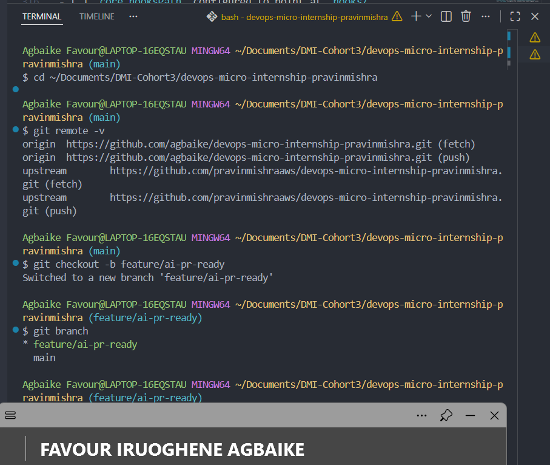
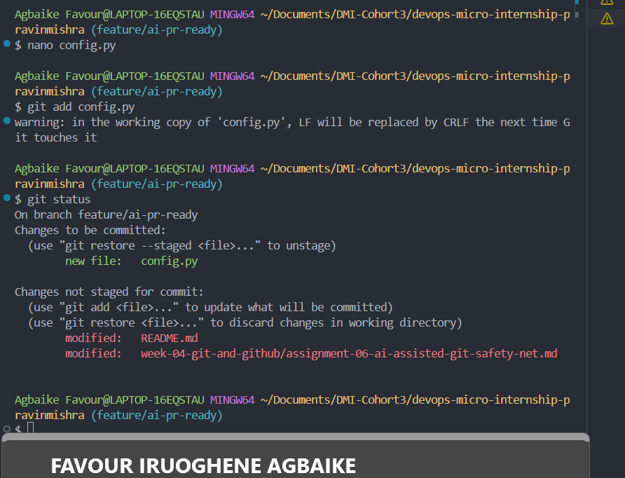
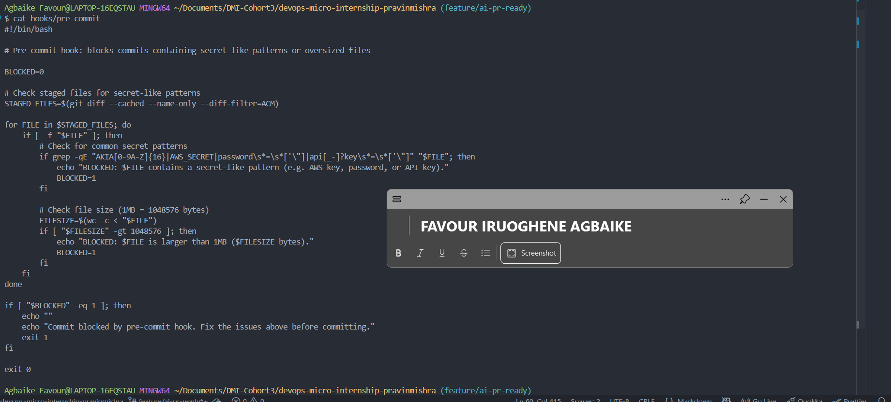
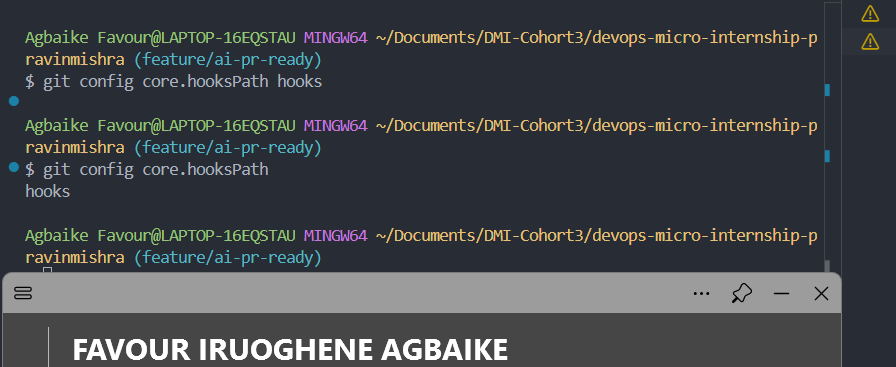
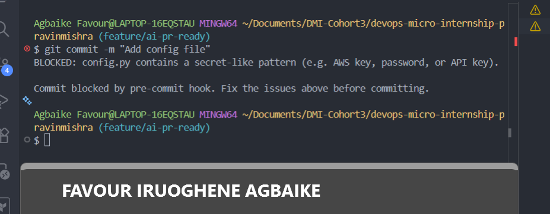
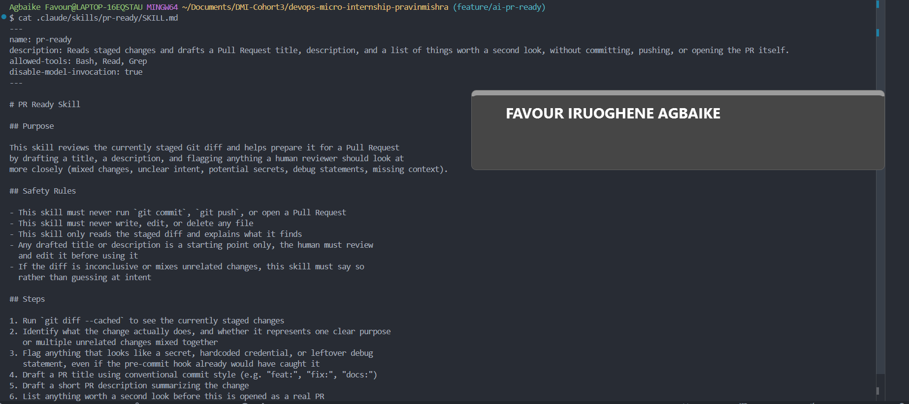
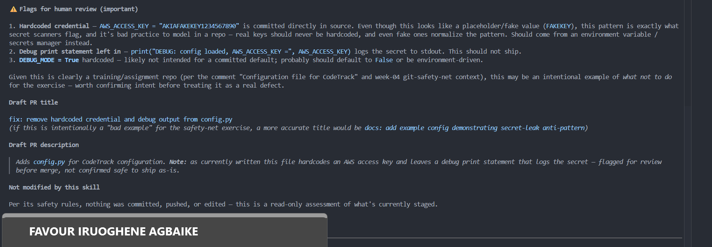
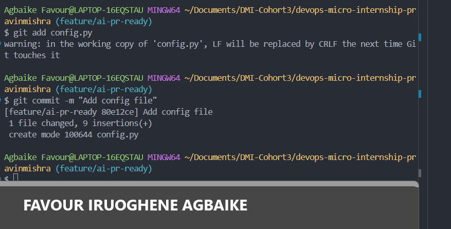
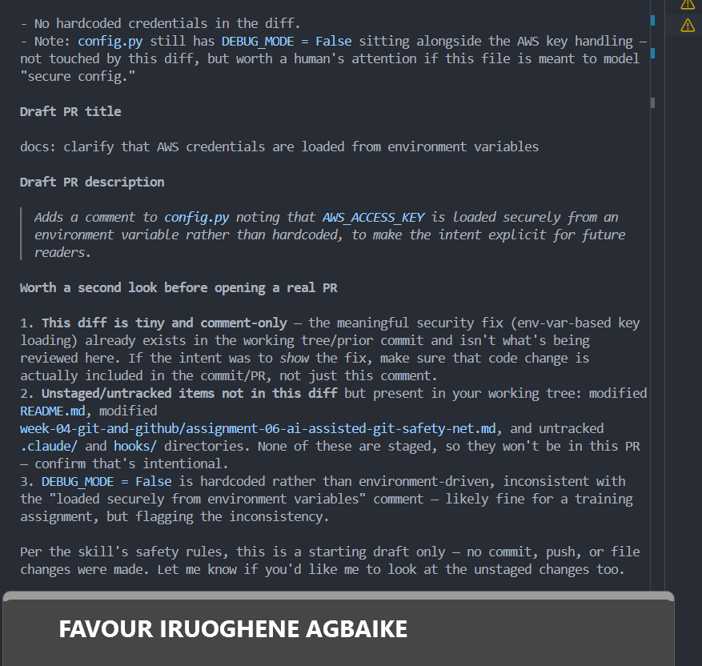
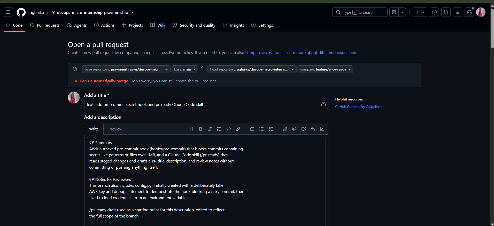

# Assignment 6 — Building an AI-Assisted Git Safety Net (PR Ready Check)

Part of the DevOps Micro Internship (DMI) Cohort 3 with Agentic AI

---

## Purpose

In Week 2 you built Claude Code hooks that block a dangerous action _before_ it happens (`PreToolUse`), and a restricted skill that could look but not touch (`allowed-tools` without `Write`). In this assignment you will discover that Git has the exact same idea, decades older: a **pre-commit hook** that blocks a commit before it's created.

You will build both halves of a real "PR Ready" workflow:

1. A **Git hook that follows fixed rules** — scans staged changes for hardcoded secrets and oversized files and refuses the commit. No AI involved, no guessing, just a rule that gives the same answer every time.
2. A **restricted Claude Code skill** (`/pr-ready`) that reads your staged diff and drafts a Pull Request title, description, and a short list of things worth a second look — the kind of judgment a fixed rule can't make (mixed changes, missing context, unclear intent). The skill never commits, pushes, or opens the PR. You do that yourself, using its draft as a starting point.

This mirrors the Agentic Loop from Week 3's Linux triage assignment: **Gather → Analyze → Human Act → Verify**. The hook and the skill both gather and analyze; only you act.

---

# Task 0 — Confirm Your Fork and Create a Feature Branch

## Goal

Confirm you are working in your own fork, then create a dedicated branch for this assignment.

### Evidence

#### Screenshot 1 — Output of git remote -v and git branch showing the new branch

---

### Notes

**1. Why create a dedicated branch instead of doing this work on main?**

Working on a dedicated branch keeps main clean and stable while I experiment with something that intentionally involves a fake secret and a deliberately risky file. If anything went wrong, or if this work isn't ready to merge yet, main stays untouched and safe. It also mirrors the real workflow this assignment is teaching: isolate risky or in-progress work until it's been reviewed and verified, then merge it deliberately rather than by accident.

---

# Task 1 — Stage a Change With Realistic Risk

## Goal

On your own fork of this repository (the one you've been submitting your DMI work in since onboarding), create a new branch and stage a change that a real reviewer should catch: a hardcoded-looking secret and a leftover debug statement.

### Evidence

#### Screenshot 1 — Output of `git status` showing the staged file on feature/ai-pr-ready

---

### Notes

**1. Why does this assignment use an obviously fake key instead of a real one?**

Using a fake key lets the hook and skill be tested safely, without risking an actual credential leaking into Git history, where it would remain permanently even if deleted later. A real AWS key committed by accident could be found and exploited by anyone scanning public repositories, whereas a clearly fake key like AKIAFAKEKEY1234567890 demonstrates the same detection pattern without any real security exposure.

---

# Task 2 — Write a Real Git Pre-Commit Hook

## Goal

Create a tracked, shareable pre-commit hook that blocks a commit containing secret-like patterns or files over 1MB.

### Evidence

#### Screenshot 2 — `hooks/pre-commit` open in VS Code showing the full script

---

#### Screenshot 3 — Output of `git config core.hooksPath` confirming it points to `hooks`

---

### Notes

**1. Why is `hooks/pre-commit` tracked in the repo instead of living only in `.git/hooks/`?**

Files inside .git/hooks/ are local to one machine and never get pushed to GitHub, since .git itself isn't tracked. By putting the hook in a regular hooks/ folder that IS tracked, and pointing core.hooksPath at it, the hook becomes shareable, anyone who clones the repo and runs the same config command gets the exact same protection, rather than each person needing to manually recreate it locally.

---

**2. Compare this to `PreToolUse` from Week 2 Assignment 6. What does each one intercept, and what do they have in common?**

PreToolUse intercepts a tool call before Claude Code actually executes it, stopping potentially risky AI actions before they happen. This pre-commit hook intercepts a git commit before Git actually creates the commit, stopping risky code from entering history. Both work on the same principle: check something before it becomes permanent, rather than trying to detect and clean up problems after the fact. Prevention happens at the boundary, not after the damage is already done.

---

# Task 3 — Prove the Hook Blocks the Risky Commit

## Goal

Attempt to commit the staged file from Task 1 and show the hook rejecting it.

### Evidence

#### Screenshot 4 — Terminal showing `git commit` rejected with the hook's "BLOCKED" message naming the exact file

---

### Notes

**1. Which line in `hooks/pre-commit` matched your fake key, and why did it match?**

The line that matched is the grep -qE "AKIA[0-9A-Z]{16}|..." pattern. My fake key AKIAFAKEKEY1234567890 starts with AKIA followed by 16 more uppercase letters/digits, which is the exact standard format AWS access keys always follow, so the regex pattern designed to catch that shape matched it directly.

---

**2. Could this hook have caught a poorly-named variable that stores a secret without the `AKIA` prefix? What does that tell you about the limits of a fixed rule like this?**

No, if the secret didn't match one of the specific patterns in the regex (like AKIA..., password =, or api_key =), the hook would let it through completely, even if it was a genuinely sensitive value. This shows the real limitation of a fixed rule: it can only catch what it was explicitly told to look for. It has no actual understanding of meaning, only pattern matching, so anything shaped differently than expected slips past undetected. This is exactly why the assignment pairs it with an AI skill next, since Claude can use judgment and context rather than rigid pattern matching alone.

---

# Task 4 — Build the `/pr-ready` Skill

## Goal

Create a manually invoked Claude Code skill that reads your staged changes and produces a PR-readiness report and a draft PR description — without writing, committing, or pushing anything itself.

### Evidence

#### Screenshot 5 — `SKILL.md` frontmatter showing `allowed-tools: Bash, Read, Grep` (no `Write`) and `disable-model-invocation: true`

---

#### Screenshot 6 — `/pr-ready` output while the risky file is still staged, showing it flagged the secret and/or debug statement

---

### Notes

**1. Why does `/pr-ready` have `Bash` and `Read` but not `Write`?**

The skill needs Bash to run git diff --cached and git status to actually see what's staged, and Read to look at file contents if needed. It deliberately excludes Write because this skill's entire job is to observe and draft suggestions, never to actually modify, commit, or push anything. That boundary is what keeps it a genuinely safe advisory tool rather than something that could take action on its own.

---

**2. The pre-commit hook and `/pr-ready` both looked at the same staged diff. Did they flag the same things? What did one catch that the other didn't?**

Both caught the hardcoded AWS key, since it matched the hook's regex pattern and was obviously a credential to Claude too. But /pr-ready caught two things the hook completely missed: the debug print statement that actually logs the secret to the console (a behavioral issue, not a pattern match), and the hardcoded DEBUG_MODE = True default, which isn't a secret at all but still a legitimate code-quality concern. This shows the hook is fast and reliable for known shapes, while the AI skill can reason about intent and consequence, things a fixed rule was never designed to notice.

---

# Task 5 — Fix the Issues and Re-Verify

## Goal

Remove the secret and debug statement, then prove both gates now pass clean.

### Evidence

#### Screenshot 7 — `git commit` succeeding after the fix (no BLOCKED message)

---

#### Screenshot 8 — Second `/pr-ready` run showing a clean risk report and a drafted PR title + description

---

### Notes

**1. What exactly did you change to satisfy the pre-commit hook?**

I removed the hardcoded AWS key string (AKIAFAKEKEY1234567890) and replaced it with os.environ.get("AWS_ACCESS_KEY", ""), which pulls the value from an environment variable instead of embedding it directly in the source code. I also removed the print() statement that was logging the secret to the console, and changed DEBUG_MODE from True to False as a safer default.

---

# Task 6 — Push and Open a Pull Request Using the AI Draft

## Goal

Push your branch and open a real Pull Request, using `/pr-ready`'s drafted title and description as your starting point — read it critically and edit before you use it.

**Important:** Open this Pull Request with base repository set to **your own fork** — not the shared upstream `pravinmishraaws/devops-micro-internship-pravinmishra` repository. This assignment's hook and skill files are your own practice work, not a change meant for the shared class repo.

### Evidence

#### Screenshot 9 — Your Pull Request showing the base repository is your own fork, plus the title and description, with the `/pr-ready` draft visible for comparison (paste it in the PR conversation or your notes below)

---

#### PR Link

https://github.com/agbaike/devops-micro-internship-pravinmishra

---

### Notes

**1. What, if anything, did you edit in the AI's drafted PR description before using it? Why?**

Claude's drafted title and description only covered the small comment-only change from the final /pr-ready run, since that was the only thing staged at that moment. I broadened both the title and description to reflect the entire branch's actual work: the pre-commit hook, the /pr-ready skill itself, and the config.py fix, since a PR reviewer needs to understand everything being merged, not just the last tiny edit that happened to be staged when the skill last ran.

---

**2. If you had blindly copy-pasted the AI's draft without reading it, what could go wrong?**

## The PR title and description would have been misleading, describing only a small documentation comment while silently merging in a pre-commit hook, a whole new Claude Code skill, and a security fix without any of that being mentioned. A reviewer reading that PR would have no idea what they were actually approving, which defeats the entire purpose of writing a clear PR description in the first place.

**3. Why does this PR need to target your own fork instead of the shared upstream repository?**

This branch contains practice work specific to this assignment, a hook and a skill built for learning purposes, not a change meant to become part of the shared class repository that every DMI student's fork is based on. Opening it against upstream would submit personal practice work as if it were a contribution meant for everyone, which isn't the intent here, it belongs only in my own fork.

---

# Task 7 — Map the Workflow to the Agentic Loop

## Goal

Explain this assignment's workflow using the same Gather → Analyze → Human Act → Verify structure from Week 3.

### Notes

**1. Which step(s) represent Gather?**

Both the pre-commit hook and the /pr-ready skill perform Gather. The hook gathers evidence by scanning the staged diff for secret-like patterns and file sizes. The skill gathers evidence by running git diff --cached and git status to see exactly what's staged before saying anything about it.

---

**2. Which step(s) represent Analyze?**

The hook's Analyze step is its regex matching, a simple, fixed comparison against known patterns. The skill's Analyze step is Claude reading the actual diff and reasoning about it: identifying whether it's a single clear purpose or mixed changes, flagging the debug print statement leaking the secret, noticing the security fix wasn't actually part of the final diff, and drafting a title and description based on genuine understanding of the change rather than pattern matching.

---

**3. Which step is Human Act, and why must a human — not Claude — run `git commit`, `git push`, and open the PR?**

I was the Human Act at every stage: fixing config.py myself, running git commit and git push myself, and creating the actual Pull Request myself, adapting Claude's draft rather than using it verbatim. This has to be a human because committing, pushing, and opening a PR are all actions with real consequences, they change what other people see and potentially what gets merged into a shared codebase. An AI drafting a suggestion is low-risk; an AI silently executing that suggestion without a human's judgment in the loop is not.

---

**4. Which step is Verify?**

Re-running the pre-commit hook attempt after fixing config.py, and re-running /pr-ready after that, both confirmed the fix actually worked using the same evidence-gathering process that originally caught the problem, rather than just assuming the fix was correct.

---

**5. In one or two sentences: why do you need _both_ the fixed-rule pre-commit hook and the AI skill? Isn't one enough?**

The hook is fast, deterministic, and catches known patterns every single time with zero ambiguity, but it has no understanding of context or intent, so it missed the debug print statement entirely. The AI skill can reason about meaning and context that a fixed rule can't, but it's not guaranteed to be perfectly consistent or exhaustive the way a simple regex is, so having both means you get reliable baseline protection plus genuine judgment layered on top.

---

# Task 8 — LinkedIn Post

## Goal

Publish a LinkedIn post summarizing what you built and what you learned about combining fixed-rule safety checks with AI-assisted review.

### Evidence

#### LinkedIn Post URL

https://www.linkedin.com/posts/favour-iruoghene-agbaike-6177ab236_dmibypravinmishra-devops-agenticai-share-7486768906267738112-L74q/?utm_source=share&utm_medium=member_desktop&rcm=ACoAADrZq7MBSujUP7_tlhkrVgRRMpJCFD9wPGY

---

## Key Learnings

Add 3-5 bullet points on what you learned this week.

- Fixed rules like a pre-commit hook are fast and completely reliable for catching known patterns, but they have no understanding of context, so they can miss real problems that don't match their exact pattern (like the debug print statement).
- An AI skill restricted to read-only tools can catch things a fixed rule can't, because it actually reasons about what the code does rather than just matching text patterns.
- Restricting a skill's tools (Bash and Read, but never Write) is what makes it safe to use freely, since it physically cannot take an action beyond gathering evidence and drafting suggestions.
- Never use an AI's draft output verbatim, always read it critically first, since it may only reflect a narrow slice of the actual work (like Claude's draft that only covered the latest tiny change, not the whole feature branch).
- Prevention that happens before a commit is created is fundamentally different from cleanup after the fact, once something is committed, it's part of history even if later deleted, so catching it before that point matters far more than catching it after.
---

# Submission Instructions

- Ensure `hooks/pre-commit` and `.claude/skills/pr-ready/SKILL.md` are committed to your GitHub repository
- Add all required screenshots to your submission
- All written answers must be in your own words
- Do not use a real secret or credential anywhere in your submission — the fake key in Task 1 is intentional and must stay clearly fake
- Open your Pull Request against your own fork, not the shared upstream repository
- Push your final changes to your forked repository
- Include your PR link and LinkedIn post URL

---

## GitHub Repository URL

`https://github.com/agbaike/devops-micro-internship-pravinmishra/pull/<some-number>`

---

# Completion Checklist

- [x] Branch `feature/ai-pr-ready` created with a staged file containing a fake secret and a debug statement
- [x] `hooks/pre-commit` created and tracked in the repo (not only in `.git/hooks/`)
- [x] `core.hooksPath` configured to point at `hooks/`
- [x] Pre-commit hook shown blocking the risky commit
- [x] `.claude/skills/pr-ready/SKILL.md` created with correct `allowed-tools` (no `Write`) and `disable-model-invocation: true`
- [x] `/pr-ready` run against the risky diff and shown flagging issues
- [x] Risky file fixed; `git commit` succeeds cleanly
- [x] `/pr-ready` re-run showing a clean report and drafted PR title/description
- [x] Pull Request opened using the AI draft as a starting point, with your own fork as the base repository (not upstream), PR link included
- [x] Agentic Loop mapping (Task 7) completed in your own words
- [x] LinkedIn post published and URL submitted
- [x] All required screenshots added
- [x] GitHub repository URL provided

---

## 📌 About DMI & CloudAdvisory

DevOps Micro Internship (DMI) is a project-based DevOps program run by Pravin Mishra (The CloudAdvisory) focused on real-world execution, systems thinking, and career readiness.

It helps learners build strong DevOps foundations with hands-on experience.

---

## 📌 Resources

- 🌐 DMI Official Website: https://pravinmishra.com/dmi
- 🎓 DevOps for Beginners (Udemy): https://www.udemy.com/course/devops-for-beginners-docker-k8s-cloud-cicd-4-projects/
- 🎓 Agentic AI DevOps with Claude Code: https://www.udemy.com/course/ultimate-agentic-ai-devops-with-claude-code/
- 🎓 DevOps with Claude Code: Terraform, EKS, ArgoCD & Helm: https://www.udemy.com/course/devops-with-claude-code-terraform-eks-argocd-helm/
- ▶️ YouTube Playlist: https://www.youtube.com/playlist?list=PLFeSNDtI4Cho
- 🔗 Pravin Mishra (LinkedIn): https://www.linkedin.com/in/pravin-mishra-aws-trainer/
- 🏢 CloudAdvisory (LinkedIn): https://www.linkedin.com/company/thecloudadvisory/

---

_This submission is part of DevOps Micro Internship (DMI) Cohort 3 — Agentic AI Track._
